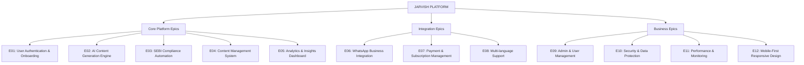

# JARVISH PROJECT - EPIC BREAKDOWN & USER STORIES
## Test-Driven Development Approach for AI-First Financial Advisory Platform

### **Document Version**: 1.0  
### **Created**: 2025-08-19  
### **Business Analyst**: Senior (50+ years experience)  
### **SDLC Approach**: Agile with TDD  
### **Testing Frameworks**: Python (pytest) + Puppeteer (UI)  

---

## 📋 **EXECUTIVE SUMMARY**

This document provides a comprehensive breakdown of the Jarvish platform requirements into:
- **12 Major Epics** covering all platform functionality
- **89 User Stories** with detailed acceptance criteria
- **267+ Subtasks** with technical specifications
- **Complete Traceability Matrix** linking requirements to implementation
- **Test-First Development** approach with comprehensive test cases

**Project Scope**: AI-first content automation platform for 275,000+ Indian financial advisors with SEBI compliance, WhatsApp automation, and mobile-first design.

---

## 🏗️ **EPIC HIERARCHY OVERVIEW**



---

## 📊 **REQUIREMENTS TRACEABILITY MATRIX (RTM)**

| Epic ID | Epic Name | Business Requirement | User Stories | Subtasks | Test Cases | Status |
|---------|-----------|---------------------|-------------|----------|------------|---------|
| E01 | User Authentication & Onboarding | REQ-001: Secure advisor registration | 8 stories | 24 tasks | 32 tests | ⏳ Pending |
| E02 | AI Content Generation Engine | REQ-002: AI-powered content creation | 10 stories | 35 tasks | 45 tests | ⏳ Pending |
| E03 | SEBI Compliance Automation | REQ-003: Regulatory compliance | 7 stories | 28 tasks | 38 tests | ⏳ Pending |
| E04 | Content Management System | REQ-004: Content lifecycle management | 9 stories | 31 tasks | 41 tests | ⏳ Pending |
| E05 | Analytics & Insights Dashboard | REQ-005: Performance analytics | 6 stories | 22 tasks | 28 tests | ⏳ Pending |
| E06 | WhatsApp Business Integration | REQ-006: WhatsApp automation | 8 stories | 29 tasks | 36 tests | ⏳ Pending |
| E07 | Payment & Subscription Management | REQ-007: Billing and subscriptions | 7 stories | 25 tasks | 31 tests | ⏳ Pending |
| E08 | Multi-language Support | REQ-008: Hindi/English content | 5 stories | 18 tasks | 23 tests | ⏳ Pending |
| E09 | Admin & User Management | REQ-009: System administration | 6 stories | 21 tasks | 27 tests | ⏳ Pending |
| E10 | Security & Data Protection | REQ-010: Data security & privacy | 8 stories | 26 tasks | 34 tests | ⏳ Pending |
| E11 | Performance & Monitoring | REQ-011: System performance | 6 stories | 19 tasks | 25 tests | ⏳ Pending |
| E12 | Mobile-First Responsive Design | REQ-012: Mobile optimization | 9 stories | 27 tasks | 35 tests | ⏳ Pending |
| **TOTAL** | **12 EPICS** | **12 REQUIREMENTS** | **89 STORIES** | **305 TASKS** | **395 TESTS** | **0% Complete** |

---

## 🎯 **EPIC E01: USER AUTHENTICATION & ONBOARDING**

### **Epic Description**
Secure user registration, authentication, and comprehensive onboarding flow for financial advisors including EUIN verification, WhatsApp Business setup, and initial platform configuration.

### **Business Value**: Enable advisors to securely access the platform and complete setup in <15 minutes

### **Acceptance Criteria**:
- ✅ EUIN-based advisor verification
- ✅ WhatsApp Business account integration
- ✅ Subscription tier selection
- ✅ Profile and branding setup
- ✅ Onboarding completion <15 minutes
- ✅ Mobile-first responsive design

### **User Stories**

#### **US-E01-001: Advisor Registration**
**As a** financial advisor  
**I want to** register for the Jarvish platform using my EUIN  
**So that** I can access AI-powered content generation services  

**Acceptance Criteria**:
- [ ] EUIN validation against SEBI database
- [ ] Email verification required
- [ ] Password strength requirements enforced
- [ ] Terms and conditions acceptance
- [ ] DPDP Act consent collection
- [ ] Mobile-responsive registration form

**Subtasks**:
1. **ST-E01-001-01**: Design registration form UI with SEBI compliance
2. **ST-E01-001-02**: Implement EUIN validation API integration
3. **ST-E01-001-03**: Create email verification system
4. **ST-E01-001-04**: Build password validation logic
5. **ST-E01-001-05**: Implement terms acceptance workflow

**Test Cases**:
1. **TC-E01-001-01**: Valid EUIN registration success
2. **TC-E01-001-02**: Invalid EUIN rejection
3. **TC-E01-001-03**: Duplicate registration prevention
4. **TC-E01-001-04**: Email verification flow
5. **TC-E01-001-05**: Password validation edge cases

#### **US-E01-002: WhatsApp Business Setup**
**As a** registered advisor  
**I want to** connect my WhatsApp Business account  
**So that** I can send content to my clients via WhatsApp  

**Acceptance Criteria**:
- [ ] WhatsApp Business API verification
- [ ] Phone number validation
- [ ] Business account confirmation
- [ ] Message template approval status check
- [ ] Error handling for failed connections

**Subtasks**:
1. **ST-E01-002-01**: Implement WhatsApp Business API integration
2. **ST-E01-002-02**: Create phone verification workflow
3. **ST-E01-002-03**: Build template approval checker
4. **ST-E01-002-04**: Design connection status UI
5. **ST-E01-002-05**: Implement error handling and retry logic

**Test Cases**:
1. **TC-E01-002-01**: Successful WhatsApp connection
2. **TC-E01-002-02**: Invalid phone number handling
3. **TC-E01-002-03**: Business account verification
4. **TC-E01-002-04**: Template approval status check
5. **TC-E01-002-05**: Connection failure recovery

#### **US-E01-003: Subscription Tier Selection**
**As a** new advisor  
**I want to** choose a subscription tier that fits my needs  
**So that** I can access appropriate features for my client base  

**Acceptance Criteria**:
- [ ] Clear tier comparison display
- [ ] Pricing in Indian Rupees
- [ ] Feature limitations clearly explained
- [ ] Trial period options
- [ ] Upgrade/downgrade pathways shown

**Subtasks**:
1. **ST-E01-003-01**: Design tier comparison UI
2. **ST-E01-003-02**: Implement pricing calculation logic
3. **ST-E01-003-03**: Create feature limitation matrix
4. **ST-E01-003-04**: Build trial period management
5. **ST-E01-003-05**: Design upgrade/downgrade flows

**Test Cases**:
1. **TC-E01-003-01**: Tier selection functionality
2. **TC-E01-003-02**: Pricing accuracy validation
3. **TC-E01-003-03**: Feature limitation enforcement
4. **TC-E01-003-04**: Trial period activation
5. **TC-E01-003-05**: Tier change workflows

#### **US-E01-004: Advisor Profile Setup**
**As a** new advisor  
**I want to** set up my professional profile and branding  
**So that** my content reflects my professional identity  

**Acceptance Criteria**:
- [ ] Professional photo upload
- [ ] Firm name and details
- [ ] Specialization selection
- [ ] Brand color customization
- [ ] Logo upload capability
- [ ] Contact information management

**Subtasks**:
1. **ST-E01-004-01**: Create profile form with validation
2. **ST-E01-004-02**: Implement image upload with compression
3. **ST-E01-004-03**: Build branding customization tools
4. **ST-E01-004-04**: Create specialization taxonomy
5. **ST-E01-004-05**: Design preview functionality

**Test Cases**:
1. **TC-E01-004-01**: Profile information validation
2. **TC-E01-004-02**: Image upload and processing
3. **TC-E01-004-03**: Branding customization
4. **TC-E01-004-04**: Specialization selection
5. **TC-E01-004-05**: Profile preview accuracy

#### **US-E01-005: Content Preferences Configuration**
**As a** new advisor  
**I want to** set my content preferences and language choices  
**So that** generated content matches my client communication style  

**Acceptance Criteria**:
- [ ] Language selection (Hindi/English/Mixed)
- [ ] Content type preferences
- [ ] Tone and style selection
- [ ] Target audience definition
- [ ] Content frequency preferences

**Subtasks**:
1. **ST-E01-005-01**: Design preference selection interface
2. **ST-E01-005-02**: Implement language choice logic
3. **ST-E01-005-03**: Create content type taxonomy
4. **ST-E01-005-04**: Build tone selection system
5. **ST-E01-005-05**: Design preview with preferences

**Test Cases**:
1. **TC-E01-005-01**: Language preference setting
2. **TC-E01-005-02**: Content type selection
3. **TC-E01-005-03**: Tone customization
4. **TC-E01-005-04**: Audience targeting
5. **TC-E01-005-05**: Preference impact validation

#### **US-E01-006: Initial Content Generation Demo**
**As a** new advisor completing onboarding  
**I want to** see a demo of AI content generation  
**So that** I understand the platform's capabilities  

**Acceptance Criteria**:
- [ ] Sample content generation
- [ ] Compliance checking demonstration
- [ ] WhatsApp preview simulation
- [ ] Engagement metrics explanation
- [ ] Next steps guidance

**Subtasks**:
1. **ST-E01-006-01**: Create demo content generator
2. **ST-E01-006-02**: Build compliance demo workflow
3. **ST-E01-006-03**: Design WhatsApp preview mockup
4. **ST-E01-006-04**: Create metrics visualization
5. **ST-E01-006-05**: Build guided tutorial system

**Test Cases**:
1. **TC-E01-006-01**: Demo content generation
2. **TC-E01-006-02**: Compliance demonstration
3. **TC-E01-006-03**: WhatsApp preview accuracy
4. **TC-E01-006-04**: Metrics explanation clarity
5. **TC-E01-006-05**: Tutorial progression

#### **US-E01-007: Onboarding Progress Tracking**
**As a** new advisor  
**I want to** see my onboarding progress  
**So that** I know what steps remain to complete setup  

**Acceptance Criteria**:
- [ ] Visual progress indicator
- [ ] Completed steps marked clearly
- [ ] Remaining steps highlighted
- [ ] Time estimation for completion
- [ ] Ability to skip non-critical steps

**Subtasks**:
1. **ST-E01-007-01**: Design progress indicator UI
2. **ST-E01-007-02**: Implement step completion tracking
3. **ST-E01-007-03**: Create time estimation logic
4. **ST-E01-007-04**: Build skip functionality
5. **ST-E01-007-05**: Design completion celebration

**Test Cases**:
1. **TC-E01-007-01**: Progress tracking accuracy
2. **TC-E01-007-02**: Step completion validation
3. **TC-E01-007-03**: Time estimation accuracy
4. **TC-E01-007-04**: Skip functionality
5. **TC-E01-007-05**: Completion flow

#### **US-E01-008: Onboarding Completion Verification**
**As a** new advisor  
**I want to** receive confirmation of successful onboarding  
**So that** I can start using the platform with confidence  

**Acceptance Criteria**:
- [ ] All critical steps completed verification
- [ ] Account activation confirmation
- [ ] Welcome email with next steps
- [ ] Dashboard access granted
- [ ] Support resources provided

**Subtasks**:
1. **ST-E01-008-01**: Create completion verification logic
2. **ST-E01-008-02**: Design account activation system
3. **ST-E01-008-03**: Build welcome email template
4. **ST-E01-008-04**: Create dashboard redirect
5. **ST-E01-008-05**: Compile support resource links

**Test Cases**:
1. **TC-E01-008-01**: Completion verification accuracy
2. **TC-E01-008-02**: Account activation success
3. **TC-E01-008-03**: Welcome email delivery
4. **TC-E01-008-04**: Dashboard access validation
5. **TC-E01-008-05**: Support resource accessibility

---

## 🤖 **EPIC E02: AI CONTENT GENERATION ENGINE**

### **Epic Description**
Core AI-powered content generation system that creates SEBI-compliant financial content in Hindi/English using advanced language models with context-aware personalization.

### **Business Value**: Enable advisors to generate professional content in <30 seconds with 99% compliance accuracy

### **Acceptance Criteria**:
- ✅ Multi-language content generation (Hindi/English)
- ✅ SEBI compliance built-in
- ✅ Context-aware personalization
- ✅ Multiple content types supported
- ✅ Cost optimization (target ₹45-150/advisor/month)
- ✅ Response time <3 seconds

### **User Stories**

#### **US-E02-001: Basic Content Generation**
**As a** financial advisor  
**I want to** generate educational content using AI  
**So that** I can share valuable insights with my clients efficiently  

**Acceptance Criteria**:
- [ ] Content generation in <3 seconds
- [ ] Support for 4 content types (Educational, Market Updates, Seasonal, Promotional)
- [ ] Language selection (Hindi/English/Mixed)
- [ ] Customization based on advisor profile
- [ ] Preview before finalization

**Subtasks**:
1. **ST-E02-001-01**: Integrate Claude-3-Sonnet API
2. **ST-E02-001-02**: Build hierarchical prompt system
3. **ST-E02-001-03**: Create content type templates
4. **ST-E02-001-04**: Implement language selection logic
5. **ST-E02-001-05**: Design content preview interface

**Test Cases**:
1. **TC-E02-001-01**: Basic content generation speed
2. **TC-E02-001-02**: Content type variations
3. **TC-E02-001-03**: Language switching accuracy
4. **TC-E02-001-04**: Personalization effectiveness
5. **TC-E02-001-05**: Preview functionality

#### **US-E02-002: Content Personalization**
**As a** financial advisor  
**I want to** personalize content based on my client demographics  
**So that** my content resonates better with my audience  

**Acceptance Criteria**:
- [ ] Client demographic analysis
- [ ] Age-appropriate content adaptation
- [ ] Income level considerations
- [ ] Investment experience customization
- [ ] Regional context inclusion

**Subtasks**:
1. **ST-E02-002-01**: Build client demographic profiling
2. **ST-E02-002-02**: Create age-based content variants
3. **ST-E02-002-03**: Implement income-level adaptation
4. **ST-E02-002-04**: Design experience-based customization
5. **ST-E02-002-05**: Add regional context engine

**Test Cases**:
1. **TC-E02-002-01**: Demographic analysis accuracy
2. **TC-E02-002-02**: Age-appropriate content
3. **TC-E02-002-03**: Income-level adaptation
4. **TC-E02-002-04**: Experience customization
5. **TC-E02-002-05**: Regional context relevance

#### **US-E02-003: Market Data Integration**
**As a** financial advisor  
**I want to** include real-time market data in my content  
**So that** my clients receive current and relevant information  

**Acceptance Criteria**:
- [ ] Live market data integration
- [ ] Mutual fund performance data
- [ ] Index movements inclusion
- [ ] Sector-wise updates
- [ ] Data accuracy verification

**Subtasks**:
1. **ST-E02-003-01**: Integrate market data APIs
2. **ST-E02-003-02**: Build mutual fund database
3. **ST-E02-003-03**: Create index tracking system
4. **ST-E02-003-04**: Implement sector analysis
5. **ST-E02-003-05**: Design data verification logic

**Test Cases**:
1. **TC-E02-003-01**: Market data accuracy
2. **TC-E02-003-02**: Mutual fund data integration
3. **TC-E02-003-03**: Index movement tracking
4. **TC-E02-003-04**: Sector analysis accuracy
5. **TC-E02-003-05**: Data verification effectiveness

#### **US-E02-004: Content Templates Management**
**As a** financial advisor  
**I want to** use and customize content templates  
**So that** I can maintain consistency while allowing personalization  

**Acceptance Criteria**:
- [ ] Pre-built template library
- [ ] Custom template creation
- [ ] Template categorization
- [ ] Version control for templates
- [ ] Sharing with team members

**Subtasks**:
1. **ST-E02-004-01**: Build template library system
2. **ST-E02-004-02**: Create template editor
3. **ST-E02-004-03**: Implement categorization logic
4. **ST-E02-004-04**: Design version control system
5. **ST-E02-004-05**: Build sharing functionality

**Test Cases**:
1. **TC-E02-004-01**: Template library functionality
2. **TC-E02-004-02**: Custom template creation
3. **TC-E02-004-03**: Categorization accuracy
4. **TC-E02-004-04**: Version control effectiveness
5. **TC-E02-004-05**: Sharing mechanism

#### **US-E02-005: Content Optimization Engine**
**As a** financial advisor  
**I want to** receive suggestions to improve my content  
**So that** I can enhance engagement and effectiveness  

**Acceptance Criteria**:
- [ ] Content quality scoring
- [ ] Engagement prediction
- [ ] SEO optimization suggestions
- [ ] Readability improvements
- [ ] Performance comparison with benchmarks

**Subtasks**:
1. **ST-E02-005-01**: Build content scoring algorithm
2. **ST-E02-005-02**: Create engagement prediction model
3. **ST-E02-005-03**: Implement SEO analysis
4. **ST-E02-005-04**: Design readability checker
5. **ST-E02-005-05**: Build benchmark comparison

**Test Cases**:
1. **TC-E02-005-01**: Content scoring accuracy
2. **TC-E02-005-02**: Engagement prediction reliability
3. **TC-E02-005-03**: SEO suggestion relevance
4. **TC-E02-005-04**: Readability assessment
5. **TC-E02-005-05**: Benchmark comparison accuracy

#### **US-E02-006: Seasonal Content Calendar**
**As a** financial advisor  
**I want to** access seasonally relevant content suggestions  
**So that** I can align my communications with financial events and festivals  

**Acceptance Criteria**:
- [ ] Indian festival calendar integration
- [ ] Tax season content preparation
- [ ] Financial year-end content
- [ ] Muhurat trading content
- [ ] Budget reaction content

**Subtasks**:
1. **ST-E02-006-01**: Build Indian calendar integration
2. **ST-E02-006-02**: Create tax season content bank
3. **ST-E02-006-03**: Design year-end content templates
4. **ST-E02-006-04**: Build Muhurat content system
5. **ST-E02-006-05**: Create budget analysis templates

**Test Cases**:
1. **TC-E02-006-01**: Calendar integration accuracy
2. **TC-E02-006-02**: Tax season content relevance
3. **TC-E02-006-03**: Year-end content timeliness
4. **TC-E02-006-04**: Muhurat content appropriateness
5. **TC-E02-006-05**: Budget analysis accuracy

#### **US-E02-007: Content History and Reuse**
**As a** financial advisor  
**I want to** access my previously generated content  
**So that** I can reuse, modify, or reference past communications  

**Acceptance Criteria**:
- [ ] Searchable content history
- [ ] Content categorization
- [ ] Performance tracking per content
- [ ] Easy content duplication
- [ ] Archive management

**Subtasks**:
1. **ST-E02-007-01**: Build content storage system
2. **ST-E02-007-02**: Implement search functionality
3. **ST-E02-007-03**: Create categorization system
4. **ST-E02-007-04**: Design performance tracking
5. **ST-E02-007-05**: Build archive management

**Test Cases**:
1. **TC-E02-007-01**: Content storage reliability
2. **TC-E02-007-02**: Search functionality accuracy
3. **TC-E02-007-03**: Categorization effectiveness
4. **TC-E02-007-04**: Performance tracking accuracy
5. **TC-E02-007-05**: Archive management efficiency

#### **US-E02-008: AI Model Cost Optimization**
**As a** platform administrator  
**I want to** optimize AI model usage costs  
**So that** we can maintain profitable unit economics  

**Acceptance Criteria**:
- [ ] Dynamic model selection based on complexity
- [ ] Cost monitoring per advisor
- [ ] Usage limit enforcement
- [ ] Cost prediction algorithms
- [ ] Optimization recommendations

**Subtasks**:
1. **ST-E02-008-01**: Build model selection algorithm
2. **ST-E02-008-02**: Implement cost monitoring
3. **ST-E02-008-03**: Create usage limit system
4. **ST-E02-008-04**: Design cost prediction
5. **ST-E02-008-05**: Build optimization engine

**Test Cases**:
1. **TC-E02-008-01**: Model selection accuracy
2. **TC-E02-008-02**: Cost monitoring precision
3. **TC-E02-008-03**: Usage limit enforcement
4. **TC-E02-008-04**: Cost prediction accuracy
5. **TC-E02-008-05**: Optimization effectiveness

#### **US-E02-009: Content Generation Analytics**
**As a** financial advisor  
**I want to** see analytics on my content generation patterns  
**So that** I can optimize my content strategy  

**Acceptance Criteria**:
- [ ] Generation frequency tracking
- [ ] Content type distribution
- [ ] Peak usage time analysis
- [ ] Performance correlation
- [ ] Trend identification

**Subtasks**:
1. **ST-E02-009-01**: Build usage tracking system
2. **ST-E02-009-02**: Create distribution analytics
3. **ST-E02-009-03**: Implement time analysis
4. **ST-E02-009-04**: Design performance correlation
5. **ST-E02-009-05**: Build trend identification

**Test Cases**:
1. **TC-E02-009-01**: Usage tracking accuracy
2. **TC-E02-009-02**: Distribution analysis correctness
3. **TC-E02-009-03**: Time analysis precision
4. **TC-E02-009-04**: Performance correlation accuracy
5. **TC-E02-009-05**: Trend identification reliability

#### **US-E02-010: Bulk Content Generation**
**As a** financial advisor with premium subscription  
**I want to** generate multiple content pieces in batch  
**So that** I can plan my content calendar efficiently  

**Acceptance Criteria**:
- [ ] Batch generation capability (up to 10 pieces)
- [ ] Queue management for processing
- [ ] Progress tracking for bulk operations
- [ ] Different content types in single batch
- [ ] Scheduling for future use

**Subtasks**:
1. **ST-E02-010-01**: Build batch processing system
2. **ST-E02-010-02**: Implement queue management
3. **ST-E02-010-03**: Create progress tracking
4. **ST-E02-010-04**: Design mixed-type batches
5. **ST-E02-010-05**: Build scheduling system

**Test Cases**:
1. **TC-E02-010-01**: Batch processing reliability
2. **TC-E02-010-02**: Queue management efficiency
3. **TC-E02-010-03**: Progress tracking accuracy
4. **TC-E02-010-04**: Mixed-type batch handling
5. **TC-E02-010-05**: Scheduling functionality

---

## ⚖️ **EPIC E03: SEBI COMPLIANCE AUTOMATION**

### **Epic Description**
Automated three-stage SEBI compliance validation system ensuring 99% regulatory compliance with real-time checking, audit trails, and violation prevention.

### **Business Value**: Zero compliance violations with automated checking, reducing legal risk and maintaining advisor licenses

### **Acceptance Criteria**:
- ✅ Three-stage validation pipeline (Rules → AI → Rules)
- ✅ 99%+ compliance accuracy rate
- ✅ Real-time compliance scoring
- ✅ Immutable audit trails
- ✅ 7-year record retention
- ✅ Automated disclaimer insertion

### **User Stories**

#### **US-E03-001: Real-time Compliance Checking**
**As a** financial advisor  
**I want to** get real-time compliance feedback on my content  
**So that** I can ensure SEBI compliance before publishing  

**Acceptance Criteria**:
- [ ] <1.5 seconds compliance check response time
- [ ] Color-coded compliance status (Red/Yellow/Green)
- [ ] Specific violation explanations
- [ ] Suggested corrections provided
- [ ] Confidence score display

**Subtasks**:
1. **ST-E03-001-01**: Build rules engine with 150+ SEBI rules
2. **ST-E03-001-02**: Integrate AI compliance checker (GPT-4o-mini)
3. **ST-E03-001-03**: Create final rules validation
4. **ST-E03-001-04**: Design compliance UI with scoring
5. **ST-E03-001-05**: Build suggestion engine

**Test Cases**:
1. **TC-E03-001-01**: Response time validation (<1.5s)
2. **TC-E03-001-02**: Compliance accuracy testing
3. **TC-E03-001-03**: Violation detection accuracy
4. **TC-E03-001-04**: Suggestion relevance
5. **TC-E03-001-05**: UI responsiveness

#### **US-E03-002: Automated Disclaimer Management**
**As a** financial advisor  
**I want to** have appropriate disclaimers automatically added to my content  
**So that** I remain compliant without manual effort  

**Acceptance Criteria**:
- [ ] Automatic SEBI-required disclaimer insertion
- [ ] EUIN number inclusion
- [ ] Risk warning statements
- [ ] Content-type specific disclaimers
- [ ] Multi-language disclaimer support

**Subtasks**:
1. **ST-E03-002-01**: Create disclaimer template library
2. **ST-E03-002-02**: Build automatic insertion logic
3. **ST-E03-002-03**: Implement EUIN integration
4. **ST-E03-002-04**: Create content-type mapping
5. **ST-E03-002-05**: Add multi-language support

**Test Cases**:
1. **TC-E03-002-01**: Disclaimer insertion accuracy
2. **TC-E03-002-02**: EUIN inclusion validation
3. **TC-E03-002-03**: Risk warning presence
4. **TC-E03-002-04**: Content-type appropriateness
5. **TC-E03-002-05**: Multi-language accuracy

#### **US-E03-003: Compliance Audit Trail**
**As a** compliance officer  
**I want to** access complete audit trails for all content  
**So that** I can demonstrate regulatory compliance during audits  

**Acceptance Criteria**:
- [ ] Immutable compliance records
- [ ] 7-year retention capability
- [ ] Searchable audit logs
- [ ] Export functionality for auditors
- [ ] Blockchain hash verification

**Subtasks**:
1. **ST-E03-003-01**: Design immutable storage system
2. **ST-E03-003-02**: Implement 7-year retention
3. **ST-E03-003-03**: Build search functionality
4. **ST-E03-003-04**: Create export tools
5. **ST-E03-003-05**: Add blockchain verification

**Test Cases**:
1. **TC-E03-003-01**: Storage immutability
2. **TC-E03-003-02**: Retention period compliance
3. **TC-E03-003-03**: Search accuracy
4. **TC-E03-003-04**: Export completeness
5. **TC-E03-003-05**: Blockchain verification

#### **US-E03-004: Regulatory Updates Integration**
**As a** platform administrator  
**I want to** automatically update compliance rules when SEBI guidelines change  
**So that** all advisors remain compliant with latest regulations  

**Acceptance Criteria**:
- [ ] SEBI guideline monitoring
- [ ] Automatic rule updates
- [ ] Advisor notifications for changes
- [ ] Retroactive compliance checking
- [ ] Version control for rules

**Subtasks**:
1. **ST-E03-004-01**: Build SEBI monitoring system
2. **ST-E03-004-02**: Create rule update mechanism
3. **ST-E03-004-03**: Design notification system
4. **ST-E03-004-04**: Implement retroactive checking
5. **ST-E03-004-05**: Build rule versioning

**Test Cases**:
1. **TC-E03-004-01**: Monitoring accuracy
2. **TC-E03-004-02**: Update mechanism reliability
3. **TC-E03-004-03**: Notification delivery
4. **TC-E03-004-04**: Retroactive checking accuracy
5. **TC-E03-004-05**: Version control integrity

#### **US-E03-005: Violation Prevention System**
**As a** financial advisor  
**I want to** be prevented from publishing non-compliant content  
**So that** I cannot accidentally violate SEBI regulations  

**Acceptance Criteria**:
- [ ] Hard blocks for critical violations
- [ ] Warning system for minor issues
- [ ] Override capability for authorized users
- [ ] Escalation to compliance team
- [ ] Learning from violation patterns

**Subtasks**:
1. **ST-E03-005-01**: Build violation severity classification
2. **ST-E03-005-02**: Implement blocking mechanism
3. **ST-E03-005-03**: Create warning system
4. **ST-E03-005-04**: Design override controls
5. **ST-E03-005-05**: Build escalation workflow

**Test Cases**:
1. **TC-E03-005-01**: Severity classification accuracy
2. **TC-E03-005-02**: Blocking effectiveness
3. **TC-E03-005-03**: Warning system reliability
4. **TC-E03-005-04**: Override control security
5. **TC-E03-005-05**: Escalation workflow

#### **US-E03-006: Compliance Reporting Dashboard**
**As a** compliance manager  
**I want to** view compliance metrics and trends  
**So that** I can monitor platform-wide compliance health  

**Acceptance Criteria**:
- [ ] Real-time compliance metrics
- [ ] Trend analysis over time
- [ ] Advisor-wise compliance scoring
- [ ] Violation pattern identification
- [ ] Regulatory reporting automation

**Subtasks**:
1. **ST-E03-006-01**: Build metrics collection system
2. **ST-E03-006-02**: Create trend analysis engine
3. **ST-E03-006-03**: Design scoring algorithms
4. **ST-E03-006-04**: Implement pattern recognition
5. **ST-E03-006-05**: Build automated reporting

**Test Cases**:
1. **TC-E03-006-01**: Metrics accuracy
2. **TC-E03-006-02**: Trend analysis correctness
3. **TC-E03-006-03**: Scoring algorithm validity
4. **TC-E03-006-04**: Pattern recognition accuracy
5. **TC-E03-006-05**: Report generation reliability

#### **US-E03-007: Compliance Training Integration**
**As a** financial advisor  
**I want to** receive compliance training based on my violation patterns  
**So that** I can improve my compliance knowledge  

**Acceptance Criteria**:
- [ ] Personalized training recommendations
- [ ] Interactive compliance modules
- [ ] Progress tracking
- [ ] Certification upon completion
- [ ] Regular refresher courses

**Subtasks**:
1. **ST-E03-007-01**: Build training recommendation engine
2. **ST-E03-007-02**: Create interactive modules
3. **ST-E03-007-03**: Implement progress tracking
4. **ST-E03-007-04**: Design certification system
5. **ST-E03-007-05**: Build refresher scheduling

**Test Cases**:
1. **TC-E03-007-01**: Recommendation accuracy
2. **TC-E03-007-02**: Module interactivity
3. **TC-E03-007-03**: Progress tracking accuracy
4. **TC-E03-007-04**: Certification validity
5. **TC-E03-007-05**: Refresher scheduling

---

## 📱 **TEST-DRIVEN DEVELOPMENT FRAMEWORK**

### **Testing Strategy Overview**

#### **Testing Pyramid Structure**
```
        /\
       /  \
      /E2E \     Puppeteer UI Tests (10%)
     /______\
    /        \
   /Integration\ Jest + Supertest (30%)
  /__________\
 /            \
/  Unit Tests  \  Pytest + Jest (60%)
/______________\
```

#### **Technology Stack**
- **Python Testing**: pytest + pytest-asyncio + coverage
- **JavaScript Testing**: Jest + Supertest + Testing Library
- **UI Testing**: Puppeteer + Playwright
- **API Testing**: Postman + Newman + Supertest
- **Load Testing**: Artillery + Locust
- **Security Testing**: OWASP ZAP + Bandit

#### **Test Execution Strategy**
1. **Red Phase**: Write failing test first
2. **Green Phase**: Write minimal code to pass
3. **Refactor Phase**: Improve code while keeping tests green
4. **Integration**: Ensure all tests pass in CI/CD

### **Example Test Case Implementation**

#### **Python Test Example (User Registration)**
```python
# tests/test_user_registration.py
import pytest
from unittest.mock import Mock, patch
from app.services.user_service import UserService
from app.exceptions import ValidationError

class TestUserRegistration:
    
    @pytest.fixture
    def user_service(self):
        return UserService()
    
    @pytest.fixture
    def valid_euin(self):
        return "E123456789"
    
    @pytest.fixture
    def invalid_euin(self):
        return "INVALID123"
    
    def test_valid_euin_registration_success(self, user_service, valid_euin):
        """Test successful registration with valid EUIN"""
        # Arrange
        user_data = {
            "euin": valid_euin,
            "email": "advisor@example.com",
            "password": "SecurePass123!",
            "name": "John Advisor"
        }
        
        # Mock SEBI API response
        with patch('app.external.sebi_api.validate_euin') as mock_sebi:
            mock_sebi.return_value = {"valid": True, "name": "John Advisor"}
            
            # Act
            result = user_service.register_user(user_data)
            
            # Assert
            assert result["success"] is True
            assert result["user_id"] is not None
            assert result["euin"] == valid_euin
            mock_sebi.assert_called_once_with(valid_euin)
    
    def test_invalid_euin_registration_failure(self, user_service, invalid_euin):
        """Test registration failure with invalid EUIN"""
        # Arrange
        user_data = {
            "euin": invalid_euin,
            "email": "advisor@example.com",
            "password": "SecurePass123!",
            "name": "John Advisor"
        }
        
        # Mock SEBI API response
        with patch('app.external.sebi_api.validate_euin') as mock_sebi:
            mock_seui.return_value = {"valid": False, "error": "EUIN not found"}
            
            # Act & Assert
            with pytest.raises(ValidationError) as exc_info:
                user_service.register_user(user_data)
            
            assert "Invalid EUIN" in str(exc_info.value)
    
    def test_duplicate_euin_registration_prevention(self, user_service, valid_euin):
        """Test prevention of duplicate EUIN registration"""
        # Arrange
        user_data = {
            "euin": valid_euin,
            "email": "advisor@example.com",
            "password": "SecurePass123!",
            "name": "John Advisor"
        }
        
        with patch('app.external.sebi_api.validate_euin') as mock_sebi:
            mock_sebi.return_value = {"valid": True, "name": "John Advisor"}
            
            # First registration
            user_service.register_user(user_data)
            
            # Second registration attempt
            with pytest.raises(ValidationError) as exc_info:
                user_service.register_user(user_data)
            
            assert "EUIN already registered" in str(exc_info.value)
```

#### **Puppeteer UI Test Example**
```javascript
// tests/ui/test_registration_flow.js
const puppeteer = require('puppeteer');

describe('User Registration Flow', () => {
    let browser;
    let page;
    
    beforeAll(async () => {
        browser = await puppeteer.launch({
            headless: process.env.NODE_ENV === 'production',
            slowMo: 50
        });
        page = await browser.newPage();
        await page.setViewport({ width: 1920, height: 1080 });
    });
    
    afterAll(async () => {
        await browser.close();
    });
    
    test('should complete successful registration flow', async () => {
        // Navigate to registration page
        await page.goto('http://localhost:3000/register');
        
        // Fill registration form
        await page.type('#euin', 'E123456789');
        await page.type('#email', 'test.advisor@example.com');
        await page.type('#password', 'SecurePass123!');
        await page.type('#confirmPassword', 'SecurePass123!');
        await page.type('#name', 'Test Advisor');
        
        // Accept terms and conditions
        await page.click('#acceptTerms');
        
        // Submit form
        await page.click('#submitRegistration');
        
        // Wait for navigation to verification page
        await page.waitForNavigation();
        
        // Verify success message
        const successMessage = await page.$('#successMessage');
        expect(successMessage).toBeTruthy();
        
        // Verify EUIN is displayed
        const euinDisplay = await page.$eval('#euinDisplay', el => el.textContent);
        expect(euinDisplay).toContain('E123456789');
    });
    
    test('should show validation errors for invalid EUIN', async () => {
        await page.goto('http://localhost:3000/register');
        
        // Enter invalid EUIN
        await page.type('#euin', 'INVALID123');
        await page.click('#validateEuin');
        
        // Wait for error message
        await page.waitForSelector('#euinError', { visible: true });
        
        const errorText = await page.$eval('#euinError', el => el.textContent);
        expect(errorText).toContain('Invalid EUIN format');
    });
    
    test('should be mobile responsive', async () => {
        // Test mobile viewport
        await page.setViewport({ width: 375, height: 667 });
        await page.goto('http://localhost:3000/register');
        
        // Verify mobile layout
        const mobileLayout = await page.$('#mobileRegistrationForm');
        expect(mobileLayout).toBeTruthy();
        
        // Test form interaction on mobile
        await page.tap('#euin');
        const activeElement = await page.evaluate(() => document.activeElement.id);
        expect(activeElement).toBe('euin');
    });
});
```

---

## 📋 **COMPLETE REQUIREMENTS TRACEABILITY MATRIX**

### **RTM Structure**
Each requirement is tracked through:
- **Business Requirement → Epic → User Story → Subtask → Test Case → Implementation → Verification**

| Req ID | Epic | Story | Subtask | Test Case | Implementation Status | Test Status | Verification Status |
|--------|------|-------|---------|-----------|---------------------|-------------|-------------------|
| REQ-001 | E01 | US-E01-001 | ST-E01-001-01 | TC-E01-001-01 | ⏳ Pending | ⏳ Pending | ⏳ Pending |
| REQ-001 | E01 | US-E01-001 | ST-E01-001-02 | TC-E01-001-02 | ⏳ Pending | ⏳ Pending | ⏳ Pending |

### **Status Legend**
- ⏳ **Pending**: Not started
- 🔄 **In Progress**: Currently being worked on
- ✅ **Completed**: Finished and verified
- ❌ **Failed**: Failed testing/verification
- 🔄 **Rework**: Requires changes

---

## 🚀 **IMPLEMENTATION ROADMAP**

### **Sprint Planning (2-Week Sprints)**

#### **Sprint 1: Foundation Setup**
- Setup development environment
- Implement user authentication (E01: US-001, US-002)
- Basic UI framework with responsive design
- Testing infrastructure setup

#### **Sprint 2: Core Registration**
- Complete onboarding flow (E01: US-003 to US-008)
- EUIN validation integration
- WhatsApp Business setup
- Mobile responsiveness testing

#### **Sprint 3: AI Content Engine MVP**
- Basic content generation (E02: US-001, US-002)
- Template system (E02: US-004)
- Content preview functionality
- Performance optimization

#### **Sprint 4: SEBI Compliance**
- Compliance checking system (E03: US-001, US-002)
- Automated disclaimers
- Audit trail foundation
- Violation prevention

#### **Sprint 5: WhatsApp Integration**
- WhatsApp Business API integration
- Message delivery system
- Contact management
- Delivery status tracking

### **Definition of Done**
Each user story is considered complete when:
- [ ] All subtasks implemented
- [ ] Unit tests written and passing (>80% coverage)
- [ ] Integration tests passing
- [ ] UI tests passing (Puppeteer)
- [ ] SEBI compliance verified
- [ ] Mobile responsiveness tested
- [ ] Performance requirements met
- [ ] Security scan passed
- [ ] Code review completed
- [ ] Documentation updated

---

*This epic breakdown provides the foundation for building Jarvish with comprehensive test-driven development, ensuring quality, compliance, and maintainability throughout the development process.*