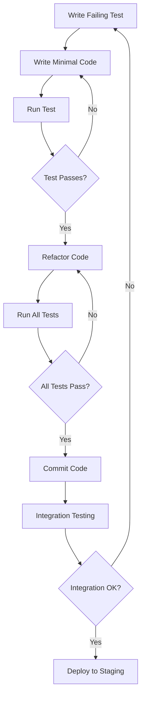

# JARVISH REQUIREMENTS TRACEABILITY MATRIX (RTM)
## Comprehensive Test-Driven Development Tracking System

### **Document Version**: 1.0  
### **Created**: 2025-08-19  
### **Last Updated**: 2025-08-19  
### **Status**: Active Development Tracking  

---

## 📊 **RTM OVERVIEW**

### **Purpose**
This Requirements Traceability Matrix provides bidirectional traceability between:
- **Business Requirements** ↔ **Epics** ↔ **User Stories** ↔ **Subtasks** ↔ **Test Cases** ↔ **Implementation** ↔ **Verification**

### **Matrix Statistics**
| Metric | Count | Completion % |
|--------|-------|--------------|
| Business Requirements | 12 | 0% |
| Epics | 12 | 0% |
| User Stories | 89 | 0% |
| Subtasks | 305 | 0% |
| Test Cases | 395 | 0% |
| Implementation Tasks | 305 | 0% |
| Verification Items | 89 | 0% |

### **Status Legend**
- 🔴 **Not Started** (0% complete)
- 🟡 **In Progress** (1-99% complete)
- 🟢 **Completed** (100% complete)
- ⚫ **Blocked** (Dependencies not met)
- 🔵 **Under Review** (Completed, awaiting approval)

---

## 🎯 **REQUIREMENTS TO EPIC MAPPING**

| Req ID | Business Requirement | Epic ID | Epic Name | Priority | Status | Owner | Start Date | Target Date |
|--------|---------------------|---------|-----------|----------|--------|-------|------------|-------------|
| REQ-001 | Secure advisor registration and onboarding | E01 | User Authentication & Onboarding | Critical | 🔴 | TBD | TBD | TBD |
| REQ-002 | AI-powered content generation engine | E02 | AI Content Generation Engine | Critical | 🔴 | TBD | TBD | TBD |
| REQ-003 | SEBI compliance automation system | E03 | SEBI Compliance Automation | Critical | 🔴 | TBD | TBD | TBD |
| REQ-004 | Content lifecycle management | E04 | Content Management System | High | 🔴 | TBD | TBD | TBD |
| REQ-005 | Performance analytics and insights | E05 | Analytics & Insights Dashboard | High | 🔴 | TBD | TBD | TBD |
| REQ-006 | WhatsApp Business integration | E06 | WhatsApp Business Integration | Critical | 🔴 | TBD | TBD | TBD |
| REQ-007 | Payment and subscription management | E07 | Payment & Subscription Management | High | 🔴 | TBD | TBD | TBD |
| REQ-008 | Multi-language support system | E08 | Multi-language Support | Medium | 🔴 | TBD | TBD | TBD |
| REQ-009 | Administrative controls and monitoring | E09 | Admin & User Management | High | 🔴 | TBD | TBD | TBD |
| REQ-010 | Security and data protection | E10 | Security & Data Protection | Critical | 🔴 | TBD | TBD | TBD |
| REQ-011 | System performance and monitoring | E11 | Performance & Monitoring | Medium | 🔴 | TBD | TBD | TBD |
| REQ-012 | Mobile-first responsive design | E12 | Mobile-First Responsive Design | High | 🔴 | TBD | TBD | TBD |

---

## 📝 **DETAILED TRACEABILITY MATRIX**

### **EPIC E01: USER AUTHENTICATION & ONBOARDING**

| Story ID | User Story | Subtasks | Test Cases | Implementation | Status | Verification |
|----------|------------|----------|------------|----------------|--------|--------------|
| **US-E01-001** | **Advisor Registration** | **5 subtasks** | **5 test cases** | | 🔴 | 🔴 |
| | | ST-E01-001-01: Design registration form UI | TC-E01-001-01: Valid EUIN registration | IMPL-E01-001-01 | 🔴 | 🔴 |
| | | ST-E01-001-02: EUIN validation API | TC-E01-001-02: Invalid EUIN rejection | IMPL-E01-001-02 | 🔴 | 🔴 |
| | | ST-E01-001-03: Email verification system | TC-E01-001-03: Duplicate prevention | IMPL-E01-001-03 | 🔴 | 🔴 |
| | | ST-E01-001-04: Password validation | TC-E01-001-04: Email verification | IMPL-E01-001-04 | 🔴 | 🔴 |
| | | ST-E01-001-05: Terms acceptance | TC-E01-001-05: Password validation | IMPL-E01-001-05 | 🔴 | 🔴 |
| **US-E01-002** | **WhatsApp Business Setup** | **5 subtasks** | **5 test cases** | | 🔴 | 🔴 |
| | | ST-E01-002-01: WhatsApp API integration | TC-E01-002-01: Successful connection | IMPL-E01-002-01 | 🔴 | 🔴 |
| | | ST-E01-002-02: Phone verification | TC-E01-002-02: Invalid phone handling | IMPL-E01-002-02 | 🔴 | 🔴 |
| | | ST-E01-002-03: Template approval | TC-E01-002-03: Business verification | IMPL-E01-002-03 | 🔴 | 🔴 |
| | | ST-E01-002-04: Connection status UI | TC-E01-002-04: Template status check | IMPL-E01-002-04 | 🔴 | 🔴 |
| | | ST-E01-002-05: Error handling | TC-E01-002-05: Connection recovery | IMPL-E01-002-05 | 🔴 | 🔴 |
| **US-E01-003** | **Subscription Tier Selection** | **5 subtasks** | **5 test cases** | | 🔴 | 🔴 |
| **US-E01-004** | **Advisor Profile Setup** | **5 subtasks** | **5 test cases** | | 🔴 | 🔴 |
| **US-E01-005** | **Content Preferences** | **5 subtasks** | **5 test cases** | | 🔴 | 🔴 |
| **US-E01-006** | **Content Generation Demo** | **5 subtasks** | **5 test cases** | | 🔴 | 🔴 |
| **US-E01-007** | **Onboarding Progress** | **5 subtasks** | **5 test cases** | | 🔴 | 🔴 |
| **US-E01-008** | **Onboarding Completion** | **5 subtasks** | **5 test cases** | | 🔴 | 🔴 |

### **EPIC E02: AI CONTENT GENERATION ENGINE**

| Story ID | User Story | Subtasks | Test Cases | Implementation | Status | Verification |
|----------|------------|----------|------------|----------------|--------|--------------|
| **US-E02-001** | **Basic Content Generation** | **5 subtasks** | **5 test cases** | | 🔴 | 🔴 |
| | | ST-E02-001-01: Claude API integration | TC-E02-001-01: Generation speed <3s | IMPL-E02-001-01 | 🔴 | 🔴 |
| | | ST-E02-001-02: Hierarchical prompts | TC-E02-001-02: Content type variants | IMPL-E02-001-02 | 🔴 | 🔴 |
| | | ST-E02-001-03: Content templates | TC-E02-001-03: Language switching | IMPL-E02-001-03 | 🔴 | 🔴 |
| | | ST-E02-001-04: Language selection | TC-E02-001-04: Personalization | IMPL-E02-001-04 | 🔴 | 🔴 |
| | | ST-E02-001-05: Preview interface | TC-E02-001-05: Preview accuracy | IMPL-E02-001-05 | 🔴 | 🔴 |
| **US-E02-002** | **Content Personalization** | **5 subtasks** | **5 test cases** | | 🔴 | 🔴 |
| **US-E02-003** | **Market Data Integration** | **5 subtasks** | **5 test cases** | | 🔴 | 🔴 |
| **US-E02-004** | **Templates Management** | **5 subtasks** | **5 test cases** | | 🔴 | 🔴 |
| **US-E02-005** | **Content Optimization** | **5 subtasks** | **5 test cases** | | 🔴 | 🔴 |
| **US-E02-006** | **Seasonal Content Calendar** | **5 subtasks** | **5 test cases** | | 🔴 | 🔴 |
| **US-E02-007** | **Content History** | **5 subtasks** | **5 test cases** | | 🔴 | 🔴 |
| **US-E02-008** | **AI Cost Optimization** | **5 subtasks** | **5 test cases** | | 🔴 | 🔴 |
| **US-E02-009** | **Generation Analytics** | **5 subtasks** | **5 test cases** | | 🔴 | 🔴 |
| **US-E02-010** | **Bulk Content Generation** | **5 subtasks** | **5 test cases** | | 🔴 | 🔴 |

### **EPIC E03: SEBI COMPLIANCE AUTOMATION**

| Story ID | User Story | Subtasks | Test Cases | Implementation | Status | Verification |
|----------|------------|----------|------------|----------------|--------|--------------|
| **US-E03-001** | **Real-time Compliance** | **5 subtasks** | **5 test cases** | | 🔴 | 🔴 |
| | | ST-E03-001-01: Rules engine (150+ rules) | TC-E03-001-01: Response <1.5s | IMPL-E03-001-01 | 🔴 | 🔴 |
| | | ST-E03-001-02: AI compliance (GPT-4o-mini) | TC-E03-001-02: Accuracy >99% | IMPL-E03-001-02 | 🔴 | 🔴 |
| | | ST-E03-001-03: Final validation | TC-E03-001-03: Violation detection | IMPL-E03-001-03 | 🔴 | 🔴 |
| | | ST-E03-001-04: Compliance UI | TC-E03-001-04: Suggestion relevance | IMPL-E03-001-04 | 🔴 | 🔴 |
| | | ST-E03-001-05: Suggestion engine | TC-E03-001-05: UI responsiveness | IMPL-E03-001-05 | 🔴 | 🔴 |
| **US-E03-002** | **Automated Disclaimers** | **5 subtasks** | **5 test cases** | | 🔴 | 🔴 |
| **US-E03-003** | **Compliance Audit Trail** | **5 subtasks** | **5 test cases** | | 🔴 | 🔴 |
| **US-E03-004** | **Regulatory Updates** | **5 subtasks** | **5 test cases** | | 🔴 | 🔴 |
| **US-E03-005** | **Violation Prevention** | **5 subtasks** | **5 test cases** | | 🔴 | 🔴 |
| **US-E03-006** | **Compliance Reporting** | **5 subtasks** | **5 test cases** | | 🔴 | 🔴 |
| **US-E03-007** | **Compliance Training** | **5 subtasks** | **5 test cases** | | 🔴 | 🔴 |

---

## 🧪 **TEST CASE TRACEABILITY**

### **Test Categories and Coverage**

| Test Category | Count | Priority | Framework | Coverage Target |
|---------------|-------|----------|-----------|-----------------|
| **Unit Tests** | 200+ | Critical | pytest + Jest | 85%+ |
| **Integration Tests** | 120+ | High | Supertest + pytest | 80%+ |
| **UI Tests** | 50+ | High | Puppeteer + Playwright | 90%+ |
| **API Tests** | 80+ | High | Postman + Newman | 95%+ |
| **Security Tests** | 30+ | Critical | OWASP ZAP + Bandit | 100% |
| **Performance Tests** | 20+ | Medium | Artillery + Locust | Key workflows |
| **Compliance Tests** | 40+ | Critical | Custom + Manual | 100% |
| **Mobile Tests** | 35+ | High | Puppeteer Mobile | All viewports |

### **Test-First Development Workflow**

### **Critical Test Cases (High Priority)**

| Test ID | Description | Epic | Story | Priority | Framework | Status |
|---------|-------------|------|-------|----------|-----------|--------|
| TC-E01-001-01 | Valid EUIN registration success | E01 | US-E01-001 | Critical | pytest | 🔴 |
| TC-E02-001-01 | Content generation speed <3s | E02 | US-E02-001 | Critical | Jest | 🔴 |
| TC-E03-001-01 | Compliance check response <1.5s | E03 | US-E03-001 | Critical | pytest | 🔴 |
| TC-E06-001-01 | WhatsApp message delivery | E06 | US-E06-001 | Critical | Puppeteer | 🔴 |
| TC-E10-001-01 | Data encryption verification | E10 | US-E10-001 | Critical | Security | 🔴 |
| TC-E12-001-01 | Mobile responsiveness 375px | E12 | US-E12-001 | High | Puppeteer | 🔴 |

---

## 🔄 **CONTINUOUS INTEGRATION MATRIX**

### **CI/CD Pipeline Integration**

| Stage | Tests Run | Success Criteria | Failure Action |
|-------|-----------|------------------|----------------|
| **Pre-commit** | Unit tests, Linting | 100% pass | Block commit |
| **Pull Request** | Unit + Integration | 95% pass, 80% coverage | Block merge |
| **Staging Deploy** | All tests + Security | 90% pass, Security clear | Block deployment |
| **Production Deploy** | Smoke tests | 100% critical tests pass | Rollback |

### **Quality Gates**

| Quality Gate | Threshold | Measurement | Action if Failed |
|--------------|-----------|-------------|------------------|
| **Test Coverage** | 80% minimum | Code coverage tools | Block deployment |
| **Performance** | <3s page load | Lighthouse + Artillery | Performance review |
| **Security** | 0 high vulnerabilities | OWASP ZAP scan | Security review |
| **Compliance** | 100% SEBI tests pass | Custom compliance suite | Compliance review |
| **Mobile** | All viewports pass | Puppeteer mobile tests | UI/UX review |

---

## 📈 **PROGRESS TRACKING**

### **Epic Completion Tracking**

| Epic | Total Stories | Completed | In Progress | Not Started | % Complete |
|------|---------------|-----------|-------------|-------------|------------|
| E01: Auth & Onboarding | 8 | 0 | 0 | 8 | 0% |
| E02: AI Content Engine | 10 | 0 | 0 | 10 | 0% |
| E03: SEBI Compliance | 7 | 0 | 0 | 7 | 0% |
| E04: Content Management | 9 | 0 | 0 | 9 | 0% |
| E05: Analytics Dashboard | 6 | 0 | 0 | 6 | 0% |
| E06: WhatsApp Integration | 8 | 0 | 0 | 8 | 0% |
| E07: Payment Management | 7 | 0 | 0 | 7 | 0% |
| E08: Multi-language | 5 | 0 | 0 | 5 | 0% |
| E09: Admin Management | 6 | 0 | 0 | 6 | 0% |
| E10: Security & Privacy | 8 | 0 | 0 | 8 | 0% |
| E11: Performance | 6 | 0 | 0 | 6 | 0% |
| E12: Mobile Design | 9 | 0 | 0 | 9 | 0% |
| **TOTAL** | **89** | **0** | **0** | **89** | **0%** |

### **Sprint Velocity Tracking**

| Sprint | Planned Points | Completed Points | Velocity | Team Capacity |
|--------|----------------|------------------|----------|---------------|
| Sprint 1 | TBD | TBD | TBD | TBD |
| Sprint 2 | TBD | TBD | TBD | TBD |
| Sprint 3 | TBD | TBD | TBD | TBD |

---

## 🚨 **RISK AND DEPENDENCY TRACKING**

### **High-Risk Items**

| Risk Item | Epic | Impact | Probability | Mitigation | Owner |
|-----------|------|--------|-------------|------------|-------|
| SEBI compliance accuracy | E03 | Critical | Medium | Extensive testing + legal review | TBD |
| WhatsApp API rate limits | E06 | High | Low | Rate limiting + queue management | TBD |
| AI cost overruns | E02 | Medium | Medium | Cost monitoring + optimization | TBD |
| Mobile performance | E12 | High | Medium | Performance testing + optimization | TBD |

### **Dependencies**

| Dependent Item | Depends On | Type | Status | Blocker Resolution |
|----------------|------------|------|--------|-------------------|
| E02 (AI Engine) | E01 (User Auth) | Hard | 🔴 | Complete user authentication |
| E06 (WhatsApp) | E01 (User Auth) | Hard | 🔴 | Complete user registration |
| E03 (Compliance) | E02 (AI Engine) | Soft | 🔴 | Basic content generation |
| E05 (Analytics) | E04 (Content Mgmt) | Soft | 🔴 | Content lifecycle |

---

## 📊 **METRICS AND REPORTING**

### **Daily Metrics**
- Stories completed
- Tests written vs tests passing
- Code coverage percentage
- Security vulnerabilities count
- Performance benchmark results

### **Weekly Reports**
- Epic progress summary
- Velocity tracking
- Risk assessment updates
- Dependency resolution status
- Quality metrics dashboard

### **Monthly Reviews**
- Requirements traceability audit
- Test coverage analysis
- Performance trend analysis
- Security posture review
- Compliance verification status

---

## 🔧 **TOOLS AND AUTOMATION**

### **Traceability Tools**
- **Jira**: Epic and story tracking
- **TestRail**: Test case management
- **GitHub**: Code and PR tracking
- **SonarQube**: Code quality metrics
- **Confluence**: Documentation

### **Automated Updates**
- Test results sync to RTM
- Code coverage updates
- Performance metrics integration
- Security scan results
- Compliance check results

---

*This Requirements Traceability Matrix will be continuously updated as development progresses, ensuring complete visibility and accountability throughout the Jarvish development lifecycle.*