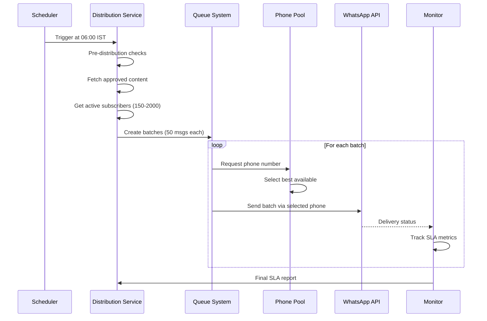

# WhatsApp Mass Distribution Architecture

## Overview
This document outlines the technical architecture for the WhatsApp mass distribution system that sends the same content to all active subscribers at 06:00 IST daily, supporting 150-2000 concurrent recipients with 99% SLA.

## System Architecture

### Core Components

```
┌─────────────────────────────────────────────────────────────┐
│                     Distribution Controller                   │
│                   (06:00 IST Scheduler)                      │
└─────────────────┬───────────────────────────────────────────┘
                  │
                  ▼
┌─────────────────────────────────────────────────────────────┐
│              Mass Distribution Service                        │
│  • Content Fetching                                          │
│  • Subscriber Management                                      │
│  • Batch Creation                                            │
│  • SLA Monitoring                                            │
└─────────────────┬───────────────────────────────────────────┘
                  │
        ┌─────────┴─────────┬─────────────┬──────────────┐
        ▼                   ▼             ▼              ▼
┌──────────────┐  ┌──────────────┐  ┌──────────┐  ┌──────────┐
│ Distribution │  │    Batch     │  │  Retry   │  │Analytics │
│    Queue     │  │   Processing │  │  Queue   │  │  Queue   │
│   (BullMQ)   │  │    Queue     │  │          │  │          │
└──────┬───────┘  └──────┬───────┘  └────┬─────┘  └────┬─────┘
       │                 │                │              │
       └─────────────────┴────────────────┴──────────────┘
                         │
                         ▼
┌─────────────────────────────────────────────────────────────┐
│               Phone Number Pool Manager                       │
│  • Load Balancing (Round-robin)                              │
│  • Quality Monitoring                                         │
│  • Automatic Failover                                        │
└─────────────────┬───────────────────────────────────────────┘
                  │
     ┌────────────┼────────────┬──────────────┐
     ▼            ▼            ▼              ▼
┌──────────┐ ┌──────────┐ ┌──────────┐ ┌──────────┐
│ Phone #1 │ │ Phone #2 │ │ Phone #3 │ │ Backup   │
│ Primary  │ │ Primary  │ │ Backup   │ │ Numbers  │
└──────────┘ └──────────┘ └──────────┘ └──────────┘
     │            │            │              │
     └────────────┴────────────┴──────────────┘
                  │
                  ▼
         WhatsApp Cloud API
```

## Key Features

### 1. Mass Distribution Service
- **Single Content → Multiple Recipients**: One approved message sent to all subscribers
- **Automated 06:00 IST Delivery**: Daily scheduled distribution
- **Subscriber Segmentation**: Tier-based priority (PREMIUM → PRO → BASIC)
- **Real-time Monitoring**: SLA tracking and alert system

### 2. Queue Management System
```javascript
// Queue Architecture
{
  "mass-distribution": {
    purpose: "Main distribution orchestration",
    concurrency: 50,
    rateLimit: "100 jobs/second"
  },
  "batch-processing": {
    purpose: "Process message batches",
    concurrency: 10,
    batchSize: 50
  },
  "distribution-retry": {
    purpose: "Handle failed deliveries",
    concurrency: 5,
    maxRetries: 3
  },
  "distribution-analytics": {
    purpose: "Store metrics and reports",
    concurrency: 3
  }
}
```

### 3. Multi-Number Load Balancing
```javascript
// Phone Number Strategy
const phonePool = [
  { id: "primary_1", capacity: 100000/day, rate: 80/sec },
  { id: "primary_2", capacity: 100000/day, rate: 80/sec },
  { id: "backup_1",  capacity: 50000/day,  rate: 50/sec }
];

// Load Balancing Algorithm
- Round-robin distribution
- Health-based selection
- Automatic failover on quality degradation
- Capacity-aware routing
```

### 4. Rate Limiting Strategy
```javascript
// Global Rate Limits
const rateLimits = {
  HIGH_QUALITY: { messagesPerSecond: 80, dailyLimit: 100000 },
  MEDIUM_QUALITY: { messagesPerSecond: 50, dailyLimit: 10000 },
  LOW_QUALITY: { messagesPerSecond: 20, dailyLimit: 1000 }
};

// Batch Processing
- Batch Size: 50 messages
- Batch Delay: 500ms between batches
- Concurrent Batches: 10 maximum
- Total Throughput: ~500 messages/second
```

## Implementation Details

### File Structure
```
backend/src/
├── services/whatsapp/
│   ├── mass-distribution-service.js    # Core distribution logic
│   ├── cloud-api-client.js            # WhatsApp API wrapper
│   ├── template-manager.js            # Template management
│   ├── queue-monitor.js               # Real-time monitoring
│   └── quality-monitor.js             # Quality tracking
├── routes/
│   ├── distribution.routes.js         # API endpoints
│   └── whatsapp-webhook.js           # Webhook handler
├── config/
│   └── whatsapp-config.js            # Configuration
└── models/
    ├── subscriber.model.js            # Subscriber schema
    └── distribution.model.js         # Distribution records
```

### API Endpoints

#### Distribution Management
```typescript
POST /api/distribution/trigger          // Manually trigger distribution
GET  /api/distribution/status           // Get current status
POST /api/distribution/schedule         // Schedule one-time distribution
POST /api/distribution/content/submit   // Submit content for approval
```

#### Subscriber Management
```typescript
GET  /api/distribution/subscribers      // List subscribers
POST /api/distribution/subscribers/add  // Add subscriber
PATCH /api/distribution/subscribers/:id/status  // Update status
POST /api/distribution/subscribers/import       // Bulk import
```

#### Analytics & Monitoring
```typescript
GET  /api/distribution/analytics        // Distribution analytics
GET  /api/distribution/health          // System health check
GET  /api/queue/status                 // Queue metrics
GET  /api/queue/alerts                 // Active alerts
```

## Delivery Flow

### 06:00 IST Daily Distribution Process



### Batch Processing Logic
```javascript
// Example: 500 subscribers
const subscribers = 500;
const batchSize = 50;
const totalBatches = 10;

// Batch distribution with jitter
for (let i = 0; i < totalBatches; i++) {
  const delay = i * 500; // 500ms between batches
  scheduleBatch(batch[i], delay);
}

// Total delivery time: ~5 seconds for 500 messages
```

## SLA Monitoring

### Key Metrics
```javascript
const slaMetrics = {
  target: 0.99,              // 99% delivery success
  window: 300000,            // 5 minutes (ms)
  alertThreshold: 0.97,      // Alert if below 97%
  
  tracking: {
    totalRecipients: 0,
    sent: 0,
    delivered: 0,
    failed: 0,
    retrying: 0
  },
  
  realtime: {
    currentSLA: 0,
    estimatedCompletion: null,
    violations: []
  }
};
```

### Alert System
- **SLA at Risk**: Current delivery rate < 97%
- **Phone Quality Degraded**: Quality rating drops
- **High Failure Rate**: >5% messages failing
- **Queue Congestion**: >1000 messages waiting
- **Critical**: No phone numbers available

## Scaling Strategy

### Current → Future Scale
```
Phase 1 (Current):
- Subscribers: 150
- Phone Numbers: 1
- Delivery Time: <1 minute
- Infrastructure: Single server

Phase 2 (6 months):
- Subscribers: 500
- Phone Numbers: 2
- Delivery Time: 2-3 minutes
- Infrastructure: Load balanced

Phase 3 (1 year):
- Subscribers: 1000
- Phone Numbers: 3
- Delivery Time: 3-4 minutes
- Infrastructure: Multi-region

Phase 4 (Target):
- Subscribers: 2000
- Phone Numbers: 3-5
- Delivery Time: 4-5 minutes
- Infrastructure: Auto-scaling
```

## Quality Protection

### Template Management
```javascript
// Template rotation on performance degradation
if (template.metrics.blockRate > 0.02) {
  rotateTemplate(template.id);
  createImprovedVersion(template);
}
```

### Phone Number Health
```javascript
// Automatic quality monitoring
phonePool.forEach(phone => {
  if (phone.quality === 'FLAGGED') {
    phone.status = 'disabled';
    activateBackup();
  } else if (phone.quality === 'LOW') {
    phone.capacity *= 0.5; // Reduce load
  }
});
```

## Error Handling

### Retry Strategy
```javascript
const retryConfig = {
  maxAttempts: 3,
  delays: [5000, 10000, 20000], // Exponential backoff
  
  conditions: {
    retry: ['RATE_LIMIT', 'NETWORK_ERROR', 'TIMEOUT'],
    noRetry: ['INVALID_NUMBER', 'BLOCKED', 'OPTED_OUT']
  }
};
```

### Fallback Mechanisms
1. **Primary Failure**: Switch to backup phone numbers
2. **Template Rejection**: Use pre-approved fallback template
3. **Queue Failure**: Store in persistent database for manual retry
4. **API Outage**: Queue messages for later delivery

## Performance Optimization

### Caching Strategy
```javascript
// Redis caching for frequent data
const cache = {
  subscribers: { ttl: 3600 },      // 1 hour
  templates: { ttl: 86400 },       // 24 hours
  phoneMetrics: { ttl: 300 },      // 5 minutes
  content: { ttl: 43200 }          // 12 hours
};
```

### Database Optimization
```sql
-- Indexes for fast queries
CREATE INDEX idx_subscribers_status ON subscribers(status);
CREATE INDEX idx_subscribers_tier ON subscribers(tier);
CREATE INDEX idx_distributions_date ON distributions(date);
CREATE INDEX idx_delivery_status ON deliveries(subscriber_id, status);
```

## Deployment Considerations

### Environment Variables
```bash
# WhatsApp Configuration
WHATSAPP_ACCESS_TOKEN=your_access_token
WHATSAPP_BUSINESS_ID=your_business_id
WHATSAPP_PHONE_NUMBER_ID_1=primary_phone_1
WHATSAPP_PHONE_NUMBER_ID_2=primary_phone_2
WHATSAPP_PHONE_NUMBER_ID_3=backup_phone

# Redis Configuration
REDIS_URL=redis://localhost:6379

# Monitoring
SENTRY_DSN=your_sentry_dsn
WEBHOOK_STATUS_URL=your_status_webhook
WEBHOOK_ALERT_URL=your_alert_webhook
```

### Infrastructure Requirements
- **Redis**: For queue management (4GB RAM minimum)
- **Node.js**: v18+ with cluster mode
- **Database**: PostgreSQL with read replicas
- **Monitoring**: Grafana + Prometheus
- **Alerts**: PagerDuty or equivalent

## Testing Strategy

### Load Testing
```javascript
// Simulate 2000 concurrent messages
const loadTest = {
  subscribers: 2000,
  duration: '5 minutes',
  expectedSLA: 0.99,
  
  scenarios: [
    'normal_load',
    'phone_failure',
    'api_rate_limit',
    'network_latency'
  ]
};
```

### Integration Testing
- WhatsApp API sandbox testing
- Template approval simulation
- Webhook delivery verification
- SLA calculation accuracy

## Success Metrics

### KPIs
1. **Delivery SLA**: >99% within 5-minute window
2. **Phone Quality**: Maintain HIGH rating
3. **Template Performance**: <2% block rate
4. **System Uptime**: 99.9% availability
5. **Cost Efficiency**: <₹0.50 per message

### Monitoring Dashboard
```
┌─────────────────────────────────────┐
│        Daily Distribution           │
├─────────────────────────────────────┤
│ Status: ✅ Completed                │
│ Recipients: 1,847 / 1,850           │
│ SLA Achievement: 99.8%              │
│ Delivery Time: 06:00 - 06:04:32    │
│                                     │
│ Phone Performance:                  │
│ • Phone #1: 800 sent (HIGH)        │
│ • Phone #2: 750 sent (HIGH)        │
│ • Phone #3: 297 sent (MEDIUM)      │
│                                     │
│ Failures: 3 (0.16%)                │
│ • Invalid numbers: 2               │
│ • Network timeout: 1               │
└─────────────────────────────────────┘
```

## Future Enhancements

1. **AI-Powered Content Optimization**
   - A/B testing for message content
   - Optimal delivery time prediction
   - Personalization within templates

2. **Advanced Analytics**
   - Engagement tracking
   - Read rate optimization
   - Subscriber behavior analysis

3. **Multi-Channel Distribution**
   - SMS fallback
   - Email integration
   - Push notifications

4. **Regional Scaling**
   - Multi-region deployment
   - CDN for media content
   - Geo-distributed queues

This architecture ensures reliable, scalable, and compliant mass distribution of WhatsApp messages to financial advisors at 06:00 IST daily.