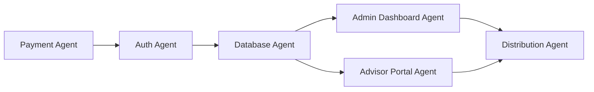
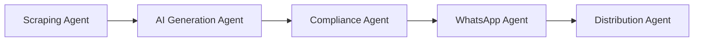
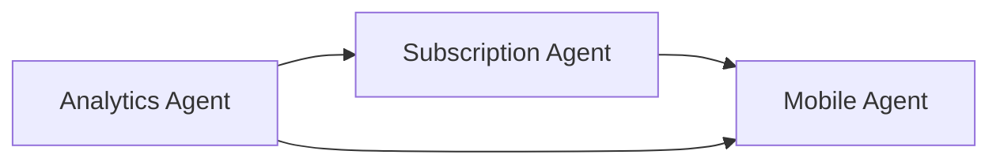
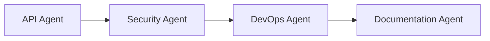

# Agent Deployment Strategy - Content Distribution Platform

## Overview
Strategic deployment of specialized AI agents across the pivoted architecture, maximizing efficiency by matching agent expertise to specific platform components.

## Agent Categorization & Assignment

### Critical Path Agents (Immediate Deployment)

#### 1. Payment Integration Agent
**Primary Responsibility**: Razorpay/Stripe integration with subscription management

**Deployment Timeline**: Week 1, Days 1-2

**Key Tasks**:
```typescript
interface PaymentAgentTasks {
  gatewaySetup: {
    razorpay: "Primary payment provider setup";
    stripe: "Backup payment provider";
    webhooks: "Event handling implementation";
  };
  subscriptionLogic: {
    plans: "₹499 basic tier creation";
    recurring: "Auto-renewal system";
    invoicing: "GST-compliant billing";
  };
  testing: {
    sandbox: "Test mode configuration";
    edgeCases: "Failure scenario handling";
  };
}
```

**Success Criteria**:
- Payment flow completion in <3 seconds
- 95% transaction success rate
- Automatic subscription renewal working
- Webhook reliability >99%

#### 2. Authentication Flow Agent
**Primary Responsibility**: Clerk auth with payment-first approach

**Deployment Timeline**: Week 1, Days 3-4

**Key Tasks**:
```typescript
interface AuthAgentTasks {
  clerkSetup: {
    configuration: "Payment-first flow";
    customization: "Branding alignment";
    middleware: "Payment verification";
  };
  userFlow: {
    registration: "Post-payment profile";
    credentials: "Email/SMS delivery";
    sessions: "JWT management";
  };
}
```

**Success Criteria**:
- Seamless payment → registration flow
- <2 second authentication time
- Secure credential delivery
- Session management working

#### 3. Database Architecture Agent
**Primary Responsibility**: PostgreSQL schema and Prisma setup

**Deployment Timeline**: Week 1, Days 5-7

**Key Tasks**:
```typescript
interface DatabaseAgentTasks {
  schemaDesign: {
    users: "Advisor profiles";
    subscriptions: "Payment records";
    content: "Distribution items";
    analytics: "Tracking tables";
  };
  prismaSetup: {
    models: "Type-safe schemas";
    migrations: "Version control";
    seedData: "Test data creation";
  };
}
```

**Success Criteria**:
- Optimized query performance <50ms
- Proper indexing strategy
- Migration system operational
- Data integrity constraints enforced

### Core Platform Agents (Week 2-3 Deployment)

#### 4. Admin Dashboard Agent
**Primary Responsibility**: Content management interface for administrators

**Deployment Timeline**: Week 2, Days 8-10

**Key Tasks**:
```typescript
interface AdminDashboardTasks {
  contentCreation: {
    editor: "Rich text with preview";
    mediaUpload: "Image management";
    scheduling: "Distribution timing";
    templates: "Reusable formats";
  };
  management: {
    userOverview: "Subscriber management";
    analytics: "Platform metrics";
    settings: "System configuration";
  };
}
```

**Success Criteria**:
- Intuitive content creation flow
- <1 second page transitions
- Bulk operations support
- Real-time preview working

#### 5. Advisor Portal Agent
**Primary Responsibility**: Subscriber dashboard for content consumption

**Deployment Timeline**: Week 2, Days 11-12

**Key Tasks**:
```typescript
interface AdvisorPortalTasks {
  contentDisplay: {
    dailyView: "Today's content";
    history: "Past content archive";
    search: "Content discovery";
  };
  actions: {
    download: "One-click media save";
    copy: "Formatted text copying";
    share: "Social media integration";
  };
  subscription: {
    status: "Plan details";
    billing: "Payment history";
    upgrade: "Plan changes";
  };
}
```

**Success Criteria**:
- Mobile-first responsive design
- <1.5 second load time
- Offline content access via PWA
- Smooth download/copy functionality

#### 6. Distribution System Agent
**Primary Responsibility**: Content delivery infrastructure

**Deployment Timeline**: Week 2, Days 13-14

**Key Tasks**:
```typescript
interface DistributionAgentTasks {
  channels: {
    email: "Primary delivery via SendGrid";
    sms: "Twilio notifications";
    inApp: "Dashboard updates";
  };
  scheduling: {
    cronJobs: "6 AM IST automation";
    queuing: "Batch processing";
    retry: "Failure recovery";
  };
}
```

**Success Criteria**:
- 99% delivery success rate
- <5 minute distribution time
- Automatic retry on failure
- Delivery tracking operational

### AI & Automation Agents (Week 4-6 Deployment)

#### 7. Web Scraping Agent
**Primary Responsibility**: Financial news aggregation

**Deployment Timeline**: Week 4, Days 22-24

**Key Tasks**:
```typescript
interface ScrapingAgentTasks {
  sources: {
    configuration: "News site adapters";
    scheduling: "6-hour intervals";
    extraction: "Content parsing";
  };
  processing: {
    cleaning: "Remove formatting";
    structuring: "Organize by topic";
    deduplication: "Remove duplicates";
  };
}
```

**Success Criteria**:
- 95% extraction accuracy
- <30 second per source processing
- Automatic error recovery
- Fresh content every 6 hours

#### 8. AI Content Generation Agent
**Primary Responsibility**: GPT-4/DALL-E integration for content creation

**Deployment Timeline**: Week 4, Days 25-28

**Key Tasks**:
```typescript
interface AIGenerationTasks {
  textGeneration: {
    prompts: "Financial advisory templates";
    variations: "Multiple content versions";
    compliance: "SEBI guideline adherence";
  };
  imageCreation: {
    dalle: "Market update graphics";
    textOverlay: "Dynamic captions";
    branding: "Consistent style";
  };
  validation: {
    quality: "Content scoring";
    accuracy: "Fact checking";
    compliance: "Regulatory review";
  };
}
```

**Success Criteria**:
- <30 second generation time
- 90% first-pass approval rate
- Compliance score >95%
- Consistent brand voice

#### 9. WhatsApp Integration Agent
**Primary Responsibility**: Business API setup and bulk messaging

**Deployment Timeline**: Week 5, Days 29-35

**Key Tasks**:
```typescript
interface WhatsAppAgentTasks {
  apiSetup: {
    authentication: "Business verification";
    templates: "Message approval";
    mediaHandling: "Image delivery";
  };
  bulkMessaging: {
    batching: "50 users per batch";
    rateLimit: "API compliance";
    tracking: "Delivery status";
  };
}
```

**Success Criteria**:
- WhatsApp Business verification complete
- 99% message delivery rate
- <1 minute total distribution time
- Media delivery working

#### 10. Compliance Validation Agent
**Primary Responsibility**: SEBI guideline enforcement

**Deployment Timeline**: Week 6, Days 36-38

**Key Tasks**:
```typescript
interface ComplianceAgentTasks {
  validation: {
    keywords: "Prohibited terms";
    disclaimers: "Required text";
    accuracy: "Fact verification";
  };
  automation: {
    preScreening: "AI validation";
    scoring: "Risk assessment";
    reporting: "Audit trails";
  };
}
```

**Success Criteria**:
- 95% accurate compliance detection
- <5 second validation time
- Automatic disclaimer insertion
- Complete audit logging

### Enhancement Agents (Week 7-9 Deployment)

#### 11. Analytics Intelligence Agent
**Primary Responsibility**: Advanced metrics and insights

**Deployment Timeline**: Week 7, Days 43-49

**Key Tasks**:
```typescript
interface AnalyticsAgentTasks {
  dataCollection: {
    events: "User action tracking";
    metrics: "Performance KPIs";
    patterns: "Behavior analysis";
  };
  insights: {
    churnPrediction: "ML models";
    contentOptimization: "Engagement analysis";
    revenueForecasting: "Growth projections";
  };
  dashboards: {
    advisor: "Personal metrics";
    admin: "Platform overview";
    realtime: "Live monitoring";
  };
}
```

**Success Criteria**:
- Real-time metrics updates
- 85% churn prediction accuracy
- Actionable insights generation
- Interactive dashboards

#### 12. Subscription Management Agent
**Primary Responsibility**: Multi-tier plan implementation

**Deployment Timeline**: Week 8, Days 50-52

**Key Tasks**:
```typescript
interface SubscriptionAgentTasks {
  tiers: {
    basic: "₹499 plan setup";
    professional: "₹999 plan setup";
    enterprise: "₹2499 plan setup";
  };
  features: {
    gating: "Feature access control";
    upgrades: "Plan transitions";
    proration: "Billing adjustments";
  };
}
```

**Success Criteria**:
- Smooth upgrade/downgrade flow
- Accurate proration calculations
- Feature gating working
- Clear tier differentiation

#### 13. Mobile Optimization Agent
**Primary Responsibility**: PWA and mobile experience

**Deployment Timeline**: Week 9, Days 57-63

**Key Tasks**:
```typescript
interface MobileAgentTasks {
  pwa: {
    manifest: "App configuration";
    serviceWorker: "Offline support";
    caching: "Content storage";
  };
  optimization: {
    performance: "Load time <1.5s";
    gestures: "Touch interactions";
    responsive: "Adaptive layouts";
  };
}
```

**Success Criteria**:
- Lighthouse score >90
- Offline functionality working
- Push notifications operational
- App-like experience achieved

### Enterprise Agents (Week 10-12 Deployment)

#### 14. API Development Agent
**Primary Responsibility**: Public API and integrations

**Deployment Timeline**: Week 11, Days 71-77

**Key Tasks**:
```typescript
interface APIAgentTasks {
  development: {
    endpoints: "RESTful API design";
    authentication: "API key system";
    documentation: "OpenAPI spec";
  };
  integrations: {
    crm: "Salesforce/HubSpot";
    communication: "Slack/Telegram";
    social: "LinkedIn API";
  };
}
```

**Success Criteria**:
- <200ms API response time
- Comprehensive documentation
- Rate limiting functional
- Third-party integrations working

#### 15. Security & Performance Agent
**Primary Responsibility**: Production hardening

**Deployment Timeline**: Week 12, Days 78-83

**Key Tasks**:
```typescript
interface SecurityAgentTasks {
  security: {
    audit: "OWASP compliance";
    encryption: "Data protection";
    access: "Role-based control";
  };
  performance: {
    loadTesting: "1000 concurrent users";
    optimization: "Query tuning";
    caching: "Redis implementation";
  };
}
```

**Success Criteria**:
- Zero critical vulnerabilities
- 99.9% uptime achieved
- <200ms p95 latency
- Scale to 1000 users verified

### Support Agents (Ongoing Deployment)

#### 16. DevOps Agent
**Primary Responsibility**: CI/CD and infrastructure

**Deployment**: Continuous throughout development

**Key Tasks**:
```typescript
interface DevOpsAgentTasks {
  infrastructure: {
    vercel: "Frontend hosting";
    database: "PostgreSQL management";
    monitoring: "Sentry/Datadog setup";
  };
  automation: {
    ci: "GitHub Actions";
    testing: "Automated test suite";
    deployment: "Zero-downtime releases";
  };
}
```

#### 17. Documentation Agent
**Primary Responsibility**: Technical and user documentation

**Deployment**: Parallel with each phase

**Key Tasks**:
```typescript
interface DocumentationAgentTasks {
  technical: {
    api: "Endpoint documentation";
    architecture: "System design docs";
    deployment: "Setup guides";
  };
  user: {
    advisor: "Platform usage guide";
    admin: "Management manual";
    faq: "Common questions";
  };
}
```

## Agent Coordination Strategy

### Phase 1 Coordination (Weeks 1-3)


**Handoff Points**:
- Payment Agent → Auth Agent: Payment verification middleware
- Auth Agent → Database Agent: User schema requirements
- Database Agent → Dashboard Agents: Data models and queries
- Dashboard Agents → Distribution Agent: Content delivery requirements

### Phase 2 Coordination (Weeks 4-6)


**Handoff Points**:
- Scraping Agent → AI Agent: Structured content for generation
- AI Agent → Compliance Agent: Generated content for validation
- Compliance Agent → WhatsApp Agent: Approved content for delivery
- WhatsApp Agent → Distribution Agent: Delivery status updates

### Phase 3 Coordination (Weeks 7-9)


**Handoff Points**:
- Analytics Agent → Subscription Agent: Churn insights for retention
- Subscription Agent → Mobile Agent: Feature gating for app
- Analytics Agent → Mobile Agent: Performance metrics

### Phase 4 Coordination (Weeks 10-12)


**Handoff Points**:
- API Agent → Security Agent: Endpoint security requirements
- Security Agent → DevOps Agent: Production hardening needs
- DevOps Agent → Documentation Agent: Deployment procedures

## Agent Performance Metrics

### Individual Agent KPIs
```typescript
interface AgentPerformance {
  payment: {
    metric: "Transaction success rate";
    target: ">95%";
    measurement: "Daily";
  };
  ai: {
    metric: "Content generation time";
    target: "<30 seconds";
    measurement: "Per generation";
  };
  whatsapp: {
    metric: "Delivery success rate";
    target: ">99%";
    measurement: "Per distribution";
  };
  analytics: {
    metric: "Insight accuracy";
    target: ">85%";
    measurement: "Weekly validation";
  };
}
```

### Collective Success Metrics
```typescript
interface CollectiveMetrics {
  integration: {
    metric: "Cross-agent handoff success";
    target: "100%";
    measurement: "Per handoff";
  };
  delivery: {
    metric: "End-to-end completion time";
    target: "<12 weeks";
    measurement: "Project timeline";
  };
  quality: {
    metric: "Production bug rate";
    target: "<5 critical bugs";
    measurement: "Post-launch 30 days";
  };
}
```

## Risk Mitigation by Agent

### Critical Risk Areas
```typescript
interface AgentRisks {
  payment: {
    risk: "Gateway failure";
    mitigation: "Multi-provider setup";
    backup: "Manual payment processing";
  };
  ai: {
    risk: "API rate limits";
    mitigation: "Multiple API keys";
    backup: "Pre-generated content queue";
  };
  whatsapp: {
    risk: "API suspension";
    mitigation: "Template pre-approval";
    backup: "Email/SMS delivery";
  };
  scaling: {
    risk: "Performance degradation";
    mitigation: "Load testing at each phase";
    backup: "Horizontal scaling plan";
  };
}
```

## Agent Resource Allocation

### Development Hours by Agent
```typescript
interface ResourceAllocation {
  criticalPath: {
    payment: 16; // hours
    auth: 16;
    database: 24;
  };
  corePlatform: {
    adminDashboard: 24;
    advisorPortal: 16;
    distribution: 16;
  };
  aiAutomation: {
    scraping: 24;
    aiGeneration: 32;
    whatsapp: 40;
    compliance: 24;
  };
  enhancement: {
    analytics: 40;
    subscription: 24;
    mobile: 40;
  };
  enterprise: {
    api: 32;
    security: 32;
  };
}
```

### Parallel Execution Opportunities
```typescript
interface ParallelExecution {
  week1: ["Payment Agent", "Database Agent"];
  week2: ["Admin Agent", "Advisor Agent"];
  week4: ["Scraping Agent", "AI Agent"];
  week7: ["Analytics Agent", "Mobile Agent"];
  week10: ["API Agent", "Security Agent"];
}
```

## Success Validation Framework

### Phase Gate Reviews
Each phase requires agent deliverable validation:

1. **Code Quality**: Automated testing coverage >80%
2. **Performance**: Meeting specified latency requirements
3. **Integration**: Successful handoff to next agent
4. **Documentation**: Complete technical specifications
5. **Security**: No critical vulnerabilities

### Final Integration Testing
```typescript
interface IntegrationTests {
  endToEnd: {
    userJourney: "Payment → Login → Content View";
    adminJourney: "Create → Approve → Distribute";
    systemFlow: "Scrape → Generate → Validate → Deliver";
  };
  performance: {
    load: "1000 concurrent users";
    distribution: "1000 messages in 5 minutes";
    response: "<200ms API calls";
  };
  reliability: {
    uptime: "99.9% over 7 days";
    delivery: "99% success rate";
    payment: "95% transaction success";
  };
}
```

This agent deployment strategy ensures efficient development through specialized expertise while maintaining integration quality and meeting aggressive timeline requirements for the content distribution platform.