# Rejection-Regeneration Workflow Diagrams
## Visual Architecture and Process Flows

---

## 1. Main Rejection-Regeneration Flow

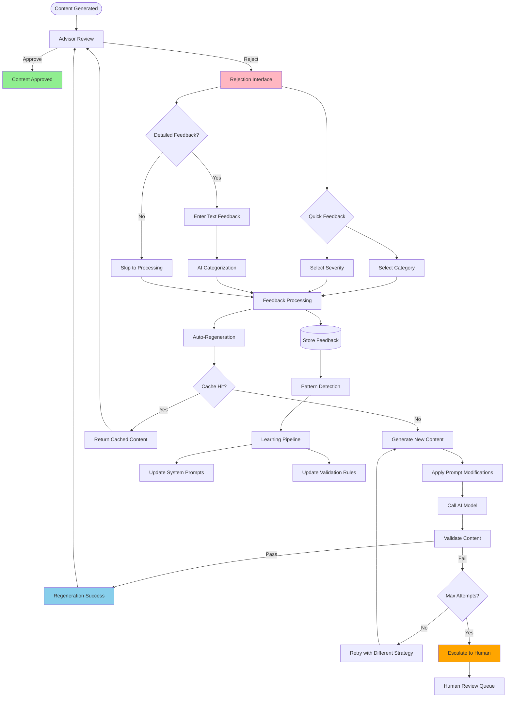

---

## 2. Feedback Capture System

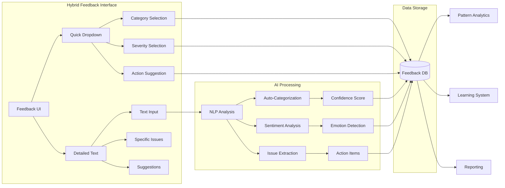

---

## 3. Pattern Detection Pipeline

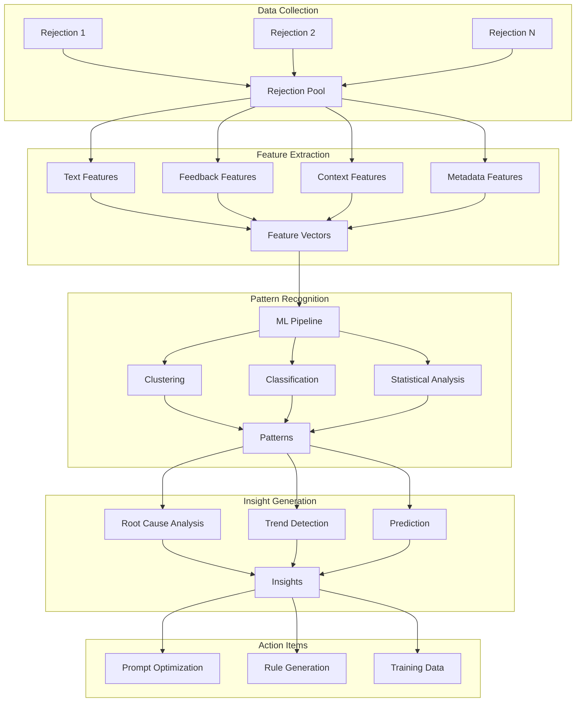

---

## 4. High-Performance Regeneration Architecture

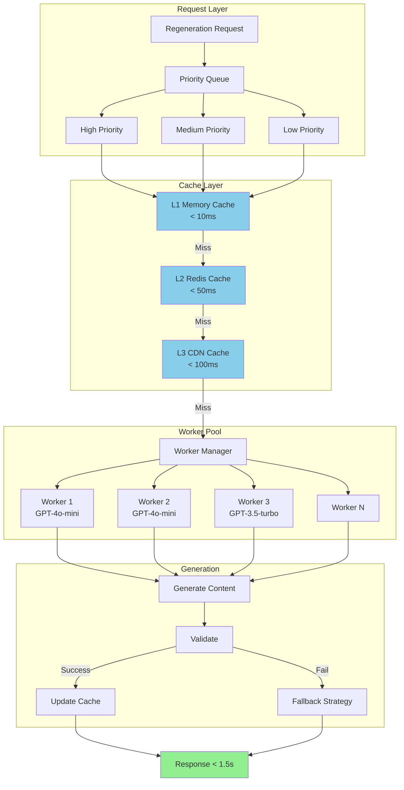

---

## 5. Escalation Framework

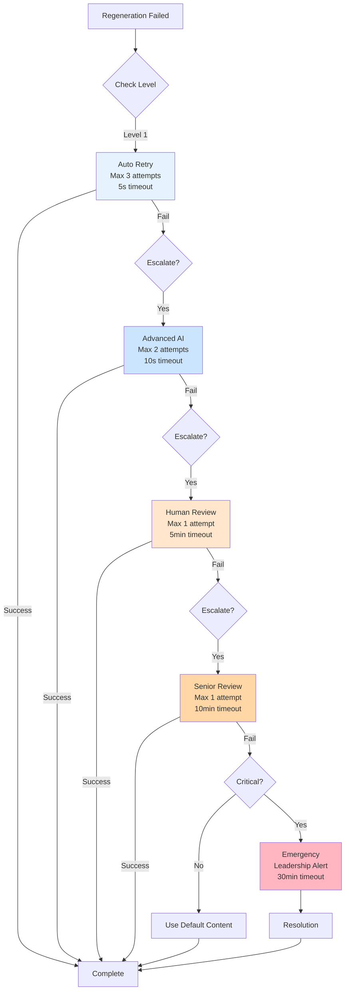

---

## 6. Learning Pipeline Integration

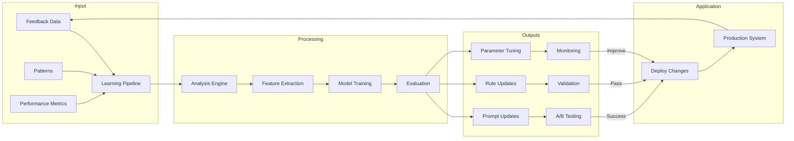

---

## 7. Fallback Strategy Decision Tree

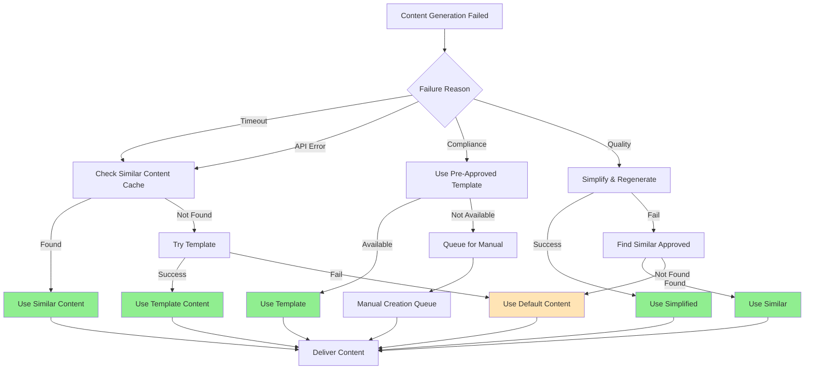

---

## 8. Real-time Performance Monitoring

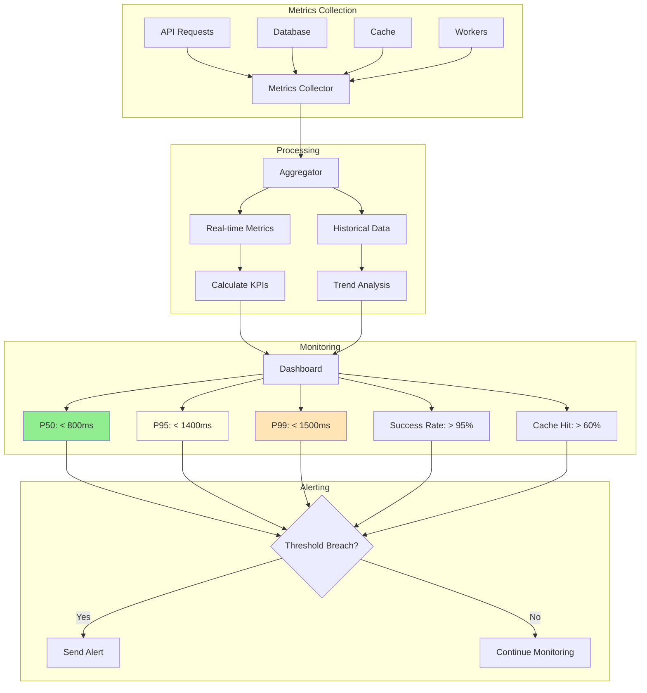

---

## 9. Prompt Evolution Workflow

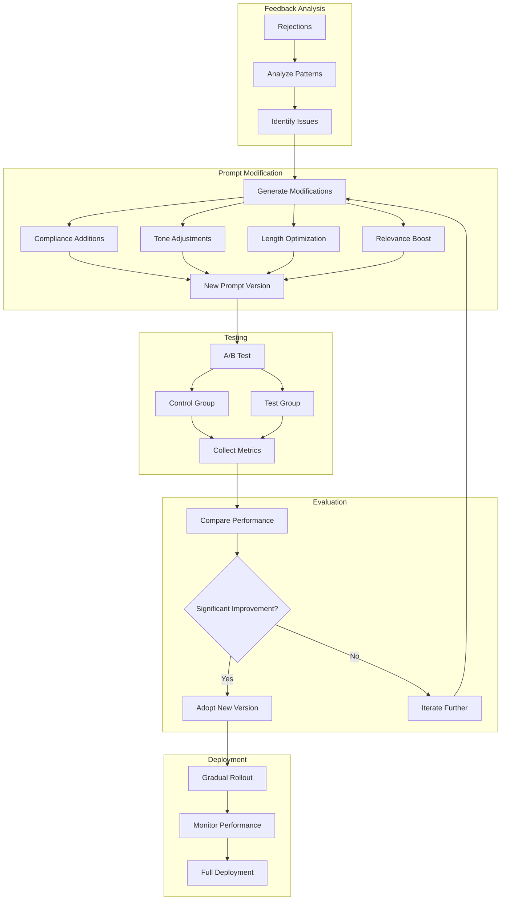

---

## 10. Data Flow Architecture

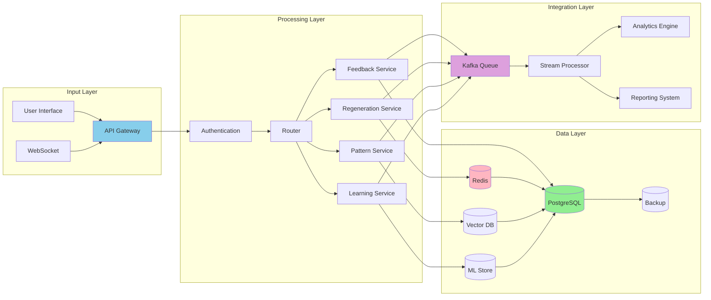

---

## 11. System State Diagram

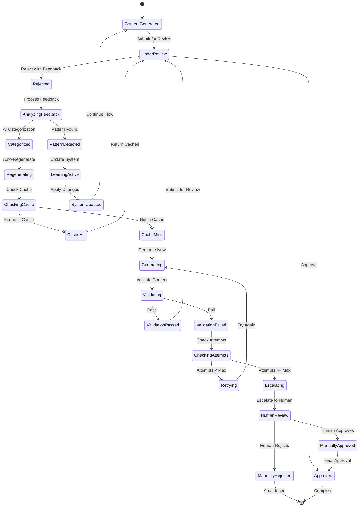

---

## 12. Performance Optimization Flow

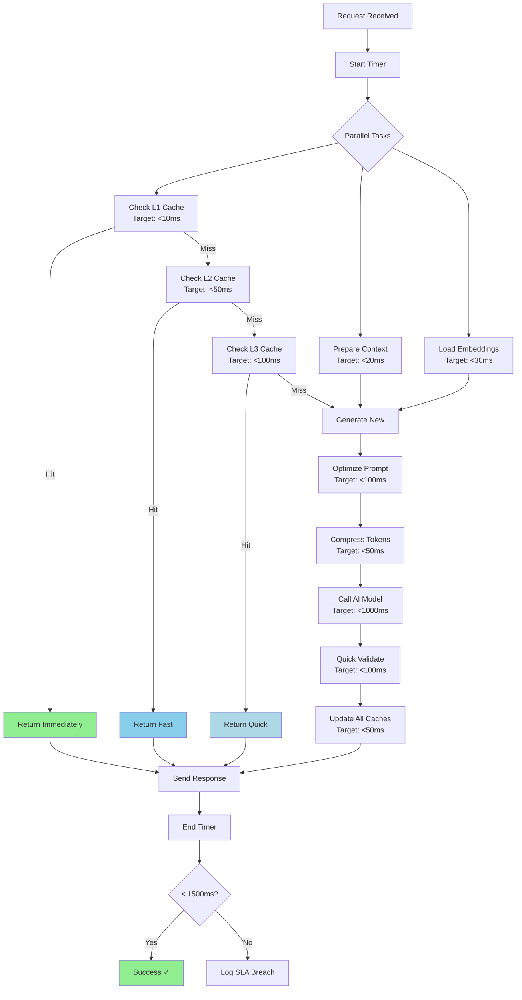

---

## Implementation Notes

### Workflow Priorities
1. **Critical Path**: Rejection → Feedback → Regeneration → Validation
2. **Performance Path**: Cache Check → Worker Selection → Generation
3. **Learning Path**: Pattern Detection → Insight Generation → System Update

### Key Decision Points
- **Cache vs Generate**: Always check cache first (60%+ hit rate expected)
- **Retry vs Escalate**: Max 3 retries before human escalation
- **Pattern Threshold**: Minimum 5 occurrences for pattern detection
- **Learning Application**: Test mode first, then gradual rollout

### Monitoring Checkpoints
- Entry: Request received
- Cache: Hit/Miss ratio
- Generation: Time and success rate
- Validation: Pass/Fail ratio
- Exit: Total processing time