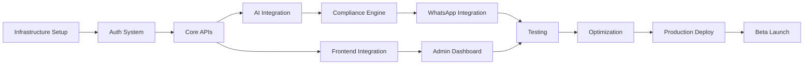

# Implementation Roadmap - 8-Week MVP Development Plan

## Executive Summary
Comprehensive 8-week implementation roadmap for delivering a production-ready Financial Advisor Content Platform MVP, with phased development approach, clear milestones, and risk mitigation strategies.

## Development Timeline Overview

```
Week 1-2: Foundation & Infrastructure Setup
Week 3-4: Core Backend Services & Database
Week 5-6: AI Integration & Compliance Engine
Week 7-8: WhatsApp Integration, Testing & Launch Preparation

Total Duration: 8 weeks (40 working days)
Team Size: 4-5 developers + 1 DevOps + 1 QA
Budget: $40,000 - $60,000 (development) + $5,000 (infrastructure setup)
```

## Phase 1: Foundation Setup (Week 1-2)

### Week 1: Infrastructure & Development Environment

#### Sprint Goals
- Complete infrastructure setup on cloud providers
- Configure CI/CD pipelines
- Set up development, staging, and production environments
- Initialize database and caching layers

#### Detailed Tasks

**Day 1-2: Cloud Infrastructure Setup**
```yaml
Tasks:
  - Set up Vercel project for Next.js frontend
  - Configure Railway/Render for backend API
  - Set up Neon PostgreSQL database
  - Configure Upstash Redis cache
  - Set up Cloudflare R2 storage buckets
  - Configure domain and SSL certificates
  
Deliverables:
  - Infrastructure provisioned
  - Environment variables configured
  - DNS and SSL working
  
Resources: 1 DevOps Engineer
Duration: 2 days
```

**Day 3-4: Development Environment & CI/CD**
```yaml
Tasks:
  - Set up GitHub repository structure
  - Configure GitHub Actions workflows
  - Set up Docker for local development
  - Configure ESLint, Prettier, Husky
  - Set up Datadog monitoring
  - Configure Sentry error tracking
  
Deliverables:
  - CI/CD pipeline operational
  - Local development environment ready
  - Monitoring dashboards configured
  
Resources: 1 DevOps + 1 Senior Developer
Duration: 2 days
```

**Day 5: Database Schema & Migrations**
```yaml
Tasks:
  - Implement Prisma schema
  - Create initial migrations
  - Set up seed data scripts
  - Configure database backups
  - Test connection pooling
  
Deliverables:
  - Database schema deployed
  - Migration system working
  - Seed data available
  
Resources: 1 Backend Developer
Duration: 1 day
```

### Week 2: Authentication & Core API Structure

#### Sprint Goals
- Implement authentication with Clerk
- Set up core API structure
- Implement basic CRUD operations
- Set up testing framework

#### Detailed Tasks

**Day 6-7: Authentication Integration**
```yaml
Tasks:
  - Integrate Clerk authentication
  - Implement JWT validation
  - Set up role-based access control
  - Create auth middleware
  - Implement session management
  
Deliverables:
  - Authentication working end-to-end
  - RBAC implemented
  - Protected routes configured
  
Resources: 1 Full-stack Developer
Duration: 2 days
```

**Day 8-9: Core API Development**
```yaml
Tasks:
  - Set up Express.js application structure
  - Implement base controllers and services
  - Create API documentation with Swagger
  - Implement request validation
  - Set up error handling middleware
  
Deliverables:
  - API structure complete
  - Basic endpoints working
  - API documentation available
  
Resources: 2 Backend Developers
Duration: 2 days
```

**Day 10: Testing Framework Setup**
```yaml
Tasks:
  - Set up Jest for unit testing
  - Configure Supertest for API testing
  - Set up Playwright for E2E tests
  - Create initial test suites
  - Configure code coverage reporting
  
Deliverables:
  - Testing framework operational
  - Initial tests passing
  - Coverage reporting working
  
Resources: 1 QA Engineer
Duration: 1 day
```

### Phase 1 Deliverables
- ✅ Cloud infrastructure provisioned
- ✅ CI/CD pipeline operational
- ✅ Database schema deployed
- ✅ Authentication system working
- ✅ Core API structure complete
- ✅ Testing framework ready

### Phase 1 Risk Mitigation
- **Risk**: Cloud service setup delays
  - **Mitigation**: Have backup providers ready (AWS as alternative)
- **Risk**: Authentication complexity
  - **Mitigation**: Use Clerk's managed service vs custom auth

## Phase 2: Core Services Development (Week 3-4)

### Week 3: Advisor & Content Management

#### Sprint Goals
- Implement advisor management system
- Build content CRUD operations
- Create admin dashboard backend
- Implement file upload system

#### Detailed Tasks

**Day 11-12: Advisor Management Service**
```yaml
Tasks:
  - Implement advisor CRUD operations
  - Create advisor profile management
  - Implement tier management
  - Build subscription tracking
  - Create advisor analytics endpoints
  
Code Structure:
  /services/advisor:
    - advisor.service.ts
    - advisor.controller.ts
    - advisor.repository.ts
    - advisor.dto.ts
    
Deliverables:
  - Advisor management API complete
  - Profile system working
  - Tier restrictions enforced
  
Resources: 1 Backend Developer
Duration: 2 days
```

**Day 13-14: Content Management System**
```yaml
Tasks:
  - Implement content pack CRUD
  - Build multi-language support
  - Create content versioning
  - Implement draft/publish workflow
  - Build content search and filtering
  
Deliverables:
  - Content API endpoints complete
  - Multi-language support working
  - Draft/publish workflow operational
  
Resources: 2 Backend Developers
Duration: 2 days
```

**Day 15: Media Upload & Processing**
```yaml
Tasks:
  - Implement Cloudinary integration
  - Build image upload endpoints
  - Create image optimization pipeline
  - Implement CDN configuration
  - Build media library management
  
Deliverables:
  - Media upload working
  - Image optimization operational
  - CDN serving assets
  
Resources: 1 Backend Developer
Duration: 1 day
```

### Week 4: Frontend Integration & Admin Features

#### Sprint Goals
- Connect frontend to backend APIs
- Implement admin approval queue
- Build advisor dashboard features
- Create content creation workflow

#### Detailed Tasks

**Day 16-17: Frontend-Backend Integration**
```yaml
Tasks:
  - Implement API client in Next.js
  - Set up React Query for data fetching
  - Build authentication flow
  - Create protected routes
  - Implement error handling
  
Deliverables:
  - Frontend connected to APIs
  - Authentication flow complete
  - Data fetching working
  
Resources: 2 Frontend Developers
Duration: 2 days
```

**Day 18-19: Admin Dashboard Implementation**
```yaml
Tasks:
  - Build approval queue interface
  - Implement batch approval actions
  - Create advisor management UI
  - Build system health dashboard
  - Implement admin analytics
  
Deliverables:
  - Admin dashboard functional
  - Approval queue working
  - Analytics displayed
  
Resources: 1 Frontend + 1 Backend Developer
Duration: 2 days
```

**Day 20: Advisor Dashboard Features**
```yaml
Tasks:
  - Build content library view
  - Implement content creation form
  - Create content preview component
  - Build analytics dashboard
  - Implement settings management
  
Deliverables:
  - Advisor dashboard complete
  - Content creation working
  - Settings management functional
  
Resources: 2 Frontend Developers
Duration: 1 day
```

### Phase 2 Deliverables
- ✅ Advisor management system complete
- ✅ Content management operational
- ✅ Media upload and processing working
- ✅ Admin dashboard functional
- ✅ Advisor dashboard features complete

### Phase 2 Risk Mitigation
- **Risk**: API integration delays
  - **Mitigation**: Use mock data layer initially
- **Risk**: Media processing bottlenecks
  - **Mitigation**: Implement async processing with queues

## Phase 3: AI & Compliance Integration (Week 5-6)

### Week 5: AI Service Integration

#### Sprint Goals
- Integrate OpenAI for content generation
- Implement compliance checking engine
- Build translation service
- Create content improvement features

#### Detailed Tasks

**Day 21-22: OpenAI Integration**
```yaml
Tasks:
  - Set up OpenAI API client
  - Implement prompt templates
  - Build token usage tracking
  - Create fallback mechanisms
  - Implement caching layer
  
Implementation:
  class AIService {
    async generateContent(prompt: string) {
      // Check cache first
      const cached = await this.cache.get(prompt);
      if (cached) return cached;
      
      // Generate with retry logic
      const result = await this.openai.generate({
        model: 'gpt-4',
        prompt: this.buildPrompt(prompt),
        maxTokens: 1500,
        temperature: 0.7
      });
      
      // Cache result
      await this.cache.set(prompt, result, 3600);
      return result;
    }
  }
  
Deliverables:
  - AI service integrated
  - Content generation working
  - Caching implemented
  
Resources: 1 Senior Backend Developer
Duration: 2 days
```

**Day 23-24: Compliance Engine Development**
```yaml
Tasks:
  - Build rule-based checking system
  - Implement SEBI compliance rules
  - Create AI-powered analysis
  - Build risk scoring algorithm
  - Implement violation detection
  
Three-Stage Pipeline:
  1. Rule-based checking (regex, keywords)
  2. AI-powered analysis (GPT-4o-mini)
  3. Human review queue (high-risk content)
  
Deliverables:
  - Compliance engine operational
  - Risk scoring working
  - Violation detection accurate
  
Resources: 1 Backend Developer + 1 Domain Expert
Duration: 2 days
```

**Day 25: Translation & Localization**
```yaml
Tasks:
  - Implement multi-language support
  - Build translation API endpoints
  - Create language detection
  - Implement content localization
  - Test Hindi and Marathi translations
  
Deliverables:
  - Translation service working
  - 3 languages supported
  - Quality validation complete
  
Resources: 1 Backend Developer
Duration: 1 day
```

### Week 6: WhatsApp Integration & Queue System

#### Sprint Goals
- Integrate WhatsApp Cloud API
- Implement message delivery system
- Build scheduling and queue management
- Create delivery tracking

#### Detailed Tasks

**Day 26-27: WhatsApp API Integration**
```yaml
Tasks:
  - Set up WhatsApp Business Account
  - Configure Cloud API access
  - Implement template management
  - Build message sending service
  - Create webhook handlers
  
Code Implementation:
  class WhatsAppService {
    async sendMessage(advisor: Advisor, content: Content) {
      const template = await this.getTemplate(content.type);
      
      const message = await this.api.messages.create({
        to: advisor.whatsappNumber,
        type: 'template',
        template: {
          name: template.name,
          language: { code: advisor.language },
          components: this.buildComponents(content)
        }
      });
      
      await this.trackDelivery(message.id, advisor.id);
      return message;
    }
  }
  
Deliverables:
  - WhatsApp API integrated
  - Message sending working
  - Webhook handling operational
  
Resources: 1 Backend Developer + WhatsApp Specialist
Duration: 2 days
```

**Day 28-29: Queue System & Scheduling**
```yaml
Tasks:
  - Implement BullMQ job queues
  - Build delivery scheduling system
  - Create retry mechanisms
  - Implement rate limiting
  - Build delivery monitoring
  
Queue Architecture:
  - content-generation-queue
  - compliance-check-queue
  - whatsapp-delivery-queue
  - email-notification-queue
  
Deliverables:
  - Queue system operational
  - Scheduling working
  - Retry logic implemented
  
Resources: 1 Senior Backend Developer
Duration: 2 days
```

**Day 30: Delivery Tracking & Analytics**
```yaml
Tasks:
  - Build delivery status tracking
  - Implement read receipts handling
  - Create delivery analytics
  - Build engagement metrics
  - Implement delivery reports
  
Deliverables:
  - Delivery tracking complete
  - Analytics dashboard updated
  - Reports generation working
  
Resources: 1 Backend Developer
Duration: 1 day
```

### Phase 3 Deliverables
- ✅ AI content generation operational
- ✅ Compliance engine working
- ✅ Translation service functional
- ✅ WhatsApp integration complete
- ✅ Queue system operational
- ✅ Delivery tracking implemented

### Phase 3 Risk Mitigation
- **Risk**: AI API rate limits
  - **Mitigation**: Implement caching and queuing
- **Risk**: WhatsApp approval delays
  - **Mitigation**: Start approval process early
- **Risk**: Compliance accuracy
  - **Mitigation**: Manual review for high-risk content

## Phase 4: Testing, Optimization & Launch (Week 7-8)

### Week 7: Testing & Bug Fixes

#### Sprint Goals
- Complete end-to-end testing
- Fix critical bugs
- Optimize performance
- Conduct security audit

#### Detailed Tasks

**Day 31-32: End-to-End Testing**
```yaml
Tasks:
  - Execute full test suite
  - Perform integration testing
  - Conduct user acceptance testing
  - Test all user workflows
  - Validate compliance checking
  
Test Scenarios:
  - Advisor onboarding flow
  - Content creation and approval
  - WhatsApp delivery
  - Payment processing
  - Admin operations
  
Deliverables:
  - Test reports generated
  - Critical bugs identified
  - Test coverage >80%
  
Resources: 2 QA Engineers + 1 Developer
Duration: 2 days
```

**Day 33-34: Performance Optimization**
```yaml
Tasks:
  - Optimize database queries
  - Implement caching strategies
  - Reduce API response times
  - Optimize frontend bundle size
  - Improve image loading
  
Performance Targets:
  - API response: <200ms P95
  - Page load: <2s
  - AI generation: <3.5s
  - WhatsApp delivery: <30s
  
Deliverables:
  - Performance targets met
  - Caching implemented
  - Load testing complete
  
Resources: 2 Senior Developers
Duration: 2 days
```

**Day 35: Security Audit & Fixes**
```yaml
Tasks:
  - Run security scanning tools
  - Fix identified vulnerabilities
  - Implement security headers
  - Test authentication flows
  - Validate data encryption
  
Security Checklist:
  - OWASP Top 10 compliance
  - Data encryption verified
  - Authentication secure
  - API rate limiting working
  - Audit logging operational
  
Deliverables:
  - Security audit complete
  - Vulnerabilities fixed
  - Compliance verified
  
Resources: 1 Security Expert + 1 Developer
Duration: 1 day
```

### Week 8: Launch Preparation & Go-Live

#### Sprint Goals
- Prepare production environment
- Create documentation
- Train initial users
- Execute launch plan

#### Detailed Tasks

**Day 36-37: Production Deployment**
```yaml
Tasks:
  - Deploy to production environment
  - Configure production monitoring
  - Set up backup systems
  - Test failover procedures
  - Verify all integrations
  
Deployment Checklist:
  - Database migrations complete
  - Environment variables set
  - SSL certificates valid
  - Monitoring active
  - Backups configured
  
Deliverables:
  - Production deployment complete
  - Monitoring operational
  - Backups verified
  
Resources: DevOps Team
Duration: 2 days
```

**Day 38: Documentation & Training**
```yaml
Tasks:
  - Create user documentation
  - Build API documentation
  - Create admin guide
  - Prepare training materials
  - Conduct team training
  
Documentation:
  - User onboarding guide
  - API reference
  - Admin operations manual
  - Troubleshooting guide
  - Video tutorials
  
Deliverables:
  - Documentation complete
  - Training materials ready
  - Team trained
  
Resources: Technical Writer + Product Manager
Duration: 1 day
```

**Day 39-40: Beta Launch & Monitoring**
```yaml
Tasks:
  - Launch with beta users
  - Monitor system performance
  - Collect user feedback
  - Fix critical issues
  - Prepare for full launch
  
Launch Activities:
  - Onboard 10 beta advisors
  - Monitor all metrics
  - Daily standup reviews
  - Quick fixes deployed
  - Feedback incorporated
  
Deliverables:
  - Beta launch successful
  - Metrics tracking
  - Issues resolved
  
Resources: Full Team
Duration: 2 days
```

### Phase 4 Deliverables
- ✅ Complete testing executed
- ✅ Performance optimized
- ✅ Security audit passed
- ✅ Production deployment complete
- ✅ Documentation ready
- ✅ Beta launch successful

### Phase 4 Risk Mitigation
- **Risk**: Critical bugs in production
  - **Mitigation**: Extensive testing and staged rollout
- **Risk**: Performance issues at scale
  - **Mitigation**: Load testing and auto-scaling
- **Risk**: User adoption challenges
  - **Mitigation**: Beta testing and feedback incorporation

## Resource Allocation

### Team Structure
```yaml
Core Team (6-7 people):
  Technical Lead:
    - Architecture decisions
    - Code reviews
    - Technical mentoring
    
  Backend Developers (2):
    - API development
    - Database design
    - Integration work
    
  Frontend Developers (2):
    - UI implementation
    - User experience
    - Component development
    
  DevOps Engineer (1):
    - Infrastructure setup
    - CI/CD pipeline
    - Monitoring
    
  QA Engineer (1):
    - Test planning
    - Test execution
    - Bug tracking
    
Support Team:
  Product Manager:
    - Requirements clarification
    - Stakeholder communication
    - Priority management
    
  Domain Expert:
    - SEBI compliance guidance
    - Content validation
    - Industry insights
    
  UI/UX Designer:
    - Design refinements
    - User experience optimization
    - Asset creation
```

### Budget Breakdown
```yaml
Development Costs (8 weeks):
  Core Team:
    - Technical Lead: $12,000
    - Backend Developers (2): $16,000
    - Frontend Developers (2): $16,000
    - DevOps Engineer: $8,000
    - QA Engineer: $6,000
    
  Total Development: $58,000
  
Infrastructure Setup:
    - Cloud services (2 months): $2,000
    - Third-party APIs: $1,000
    - Development tools: $500
    - Testing services: $500
    
  Total Infrastructure: $4,000
  
Additional Costs:
    - Security audit: $2,000
    - Performance testing: $1,000
    - Documentation: $1,000
    
  Total Additional: $4,000
  
Grand Total: $66,000
```

## Critical Path Analysis

### Dependencies & Critical Path


### Critical Milestones
```yaml
Week 1:
  - Infrastructure operational
  - Development environment ready
  
Week 2:
  - Authentication working
  - Core API structure complete
  
Week 3:
  - Advisor management functional
  - Content system operational
  
Week 4:
  - Frontend integrated
  - Admin features complete
  
Week 5:
  - AI generation working
  - Compliance engine operational
  
Week 6:
  - WhatsApp delivery functional
  - Queue system operational
  
Week 7:
  - Testing complete
  - Performance optimized
  
Week 8:
  - Production deployed
  - Beta launch successful
```

## Risk Management Matrix

### High-Priority Risks
```yaml
Technical Risks:
  AI Service Reliability:
    Impact: High
    Probability: Medium
    Mitigation:
      - Implement fallback models
      - Cache frequent requests
      - Manual content library backup
    
  WhatsApp API Approval:
    Impact: High
    Probability: Medium
    Mitigation:
      - Start approval process early
      - Have SMS backup option
      - Prepare all documentation upfront
    
  Scalability Issues:
    Impact: High
    Probability: Low
    Mitigation:
      - Load testing from week 6
      - Auto-scaling configured
      - Database optimization
      
Compliance Risks:
  SEBI Regulation Changes:
    Impact: High
    Probability: Low
    Mitigation:
      - Regular compliance reviews
      - Flexible rule engine
      - Legal advisory board
    
  Data Privacy Violations:
    Impact: High
    Probability: Low
    Mitigation:
      - DPDP compliance built-in
      - Regular security audits
      - Encryption everywhere
      
Business Risks:
  User Adoption:
    Impact: Medium
    Probability: Medium
    Mitigation:
      - Beta testing program
      - User feedback loops
      - Onboarding assistance
    
  Competition:
    Impact: Medium
    Probability: High
    Mitigation:
      - Fast time to market
      - Unique AI features
      - Competitive pricing
```

## Success Metrics

### Launch Success Criteria
```yaml
Technical Metrics:
  - System uptime: >99.5%
  - API response time: <200ms P95
  - WhatsApp delivery rate: >98%
  - AI generation success: >95%
  - Zero critical security issues
  
Business Metrics:
  - 50+ beta advisors onboarded
  - 500+ content packs created
  - 90% approval rate
  - <2% error rate
  - 80% user satisfaction
  
Quality Metrics:
  - Code coverage: >80%
  - 0 P0 bugs in production
  - <5 P1 bugs in production
  - Documentation complete
  - All compliance checks passing
```

## Post-Launch Roadmap

### Month 2-3 Enhancements
```yaml
Priority Features:
  - LinkedIn API integration
  - Advanced analytics dashboard
  - Bulk content generation
  - Custom branding options
  - API access for Pro tier
  
Infrastructure:
  - Multi-region deployment
  - Advanced caching strategies
  - Performance optimizations
  - Enhanced monitoring
  
Growth Features:
  - Referral program
  - Partner integrations
  - Advanced AI features
  - Mobile app planning
```

### Scaling Plan
```yaml
User Growth Targets:
  Month 1: 100 advisors
  Month 3: 500 advisors
  Month 6: 1,000 advisors
  Year 1: 2,000+ advisors
  
Infrastructure Scaling:
  - Horizontal scaling ready
  - Database sharding planned
  - CDN optimization
  - Cost optimization strategies
```

## Conclusion

This 8-week implementation roadmap provides a structured approach to delivering a production-ready MVP for the Financial Advisor Content Platform. Key success factors include:

1. **Phased Development**: Clear separation of concerns with dependencies managed
2. **Risk Mitigation**: Proactive identification and mitigation strategies
3. **Quality Focus**: Comprehensive testing and security measures
4. **Scalability**: Architecture designed for growth from day one
5. **Compliance First**: SEBI and DPDP compliance built into core

The roadmap balances speed to market with quality and compliance requirements, ensuring a robust platform ready for the Indian financial advisory market.